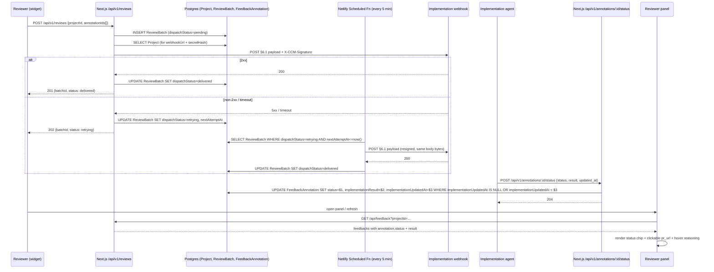

# CCM-279 Contract layer: projects, admin, webhook round-trip

## Overview

This plan lands the P1 contract layer for CCM Feedback: a `Project` + `ReviewBatch` data model, an admin UI for project CRUD with Supabase Auth, an outbound HMAC-signed webhook that dispatches review batches to a per-project implementation agent, and an inbound status callback that surfaces per-annotation state in the reviewer panel. At the end of this PR, the end-to-end round-trip runs locally against a stub implementation agent.

The work is scoped to make every acceptance criterion in the ticket mechanically verifiable. It does not ship any Phase 2/3 feature work from `docs/spec.md` (voice/Whisper, image swaps, real-time panel updates) — those stay out of scope.

## Problem Frame

CCM-277 rebranded the codebase and wired Supabase as the backing store, but the service still has no concept of a project configuration, no outbound webhook, no admin surface, and no way for a downstream implementation agent to report status back. Without those pieces, the service is just a comment tool — its value proposition (emitting structured change-request objects on a stable contract) is unrealized.

CCM-279 is the ticket that turns the output contract in `docs/spec.md §6` from prose into running code. Every subsequent CCM ticket (voice, image swaps, richer dashboards) depends on this contract layer existing.

Three non-mechanical decisions shape the design:

1. **Retry-queue runtime.** The spec guarantees "failed webhook deliveries are retried with exponential backoff for up to 24h" (§6.3). Netlify Functions are stateless and time-bound; a naïve `setTimeout` dies with the request. The plan picks **Netlify Scheduled Functions** (cron-driven, persistent state in Postgres via `ReviewBatch.dispatchStatus`) as the durable runtime, with a synchronous first-attempt dispatch for fast-path success.
2. **HMAC canonicalization.** The verifier script (part of the acceptance criteria) must reproduce the exact bytes the server signed. JSON field ordering is not stable across serializers; this plan defines a single canonicalization function in `packages/core` that both the signer and any verifier use.
3. **Admin auth boundary.** Supabase Auth + magic link is new to this repo. The plan wires it as a Next.js middleware that guards `/admin/*` plus a server-side allowlist check in route handlers — defense in depth so a middleware bypass doesn't expose project secrets.

## Requirements Trace

Every requirement maps to at least one implementation unit and at least one acceptance check.

- **R1.** Admins sign in via Supabase Auth magic link; only emails in the allowlist (`dev@ccmdesign.ca`, configurable via `CCM_ADMIN_EMAIL_ALLOWLIST` env) can reach `/admin/*`.
- **R2.** Admins can create, list, edit, rotate-secret, and delete `Project` rows; webhook secret is hashed at rest and plaintext is shown exactly once on creation and on rotation.
- **R3.** A new `Project` row supports `name`, `stagingUrl`, `implementationWebhookUrl`, hashed `implementationWebhookSecret`, `createdAt`.
- **R4.** `ReviewBatch` rows persist dispatch state (`pending | retrying | delivered | failed`), attempt count, and last error.
- **R5.** The widget submits against a project identified by `data-project` (project id); the existing string `projectName` field becomes a FK `projectId` with a one-shot data migration that preserves existing feedback by auto-creating a default `Project` row per distinct `projectName`.
- **R6.** `FeedbackAnnotation` gains three fields — `status` (default `"submitted"`), `implementationResult` (JSON), `implementationUpdatedAt` (timestamp).
- **R7.** `POST /api/v1/reviews` aggregates session annotations for a project into a `ReviewBatch` and POSTs the §6.1 payload to the project's `implementationWebhookUrl`, signed with `X-CCM-Signature: sha256=<hex>` using HMAC-SHA256 over a canonical JSON serialization.
- **R8.** Dispatch is synchronous on first attempt; failures enqueue for retry via a Netlify Scheduled Function running every 5 minutes; backoff is exponential with jitter and caps at 24h total.
- **R9.** Dispatch is idempotent by annotation UUID — retrying the same batch produces the same signed payload and the implementation agent can safely ignore duplicates via stable annotation ids.
- **R10.** `POST /api/v1/annotations/:id/status` accepts a Zod-validated `{status, result?, updated_at}` body, applies "newer `updated_at` wins" semantics, and does not require auth by default. An optional `CCM_CALLBACK_BEARER_TOKEN` env scaffolds bearer-token auth off by default.
- **R11.** The reviewer panel renders a status chip per annotation with appropriate colours for known statuses (`submitted | acknowledged | applied | escalated | rejected | <custom>`), a clickable `result.pr_url` / `result.task_url` when present, and a hover-reveal for `result.reasoning`.
- **R12.** A verifier script (under `scripts/`) independently validates HMAC signatures using just the project secret + the outbound payload bytes.
- **R13.** A mock webhook Next route (under `apps/demo/src/app/api/mock-webhook/*`) logs received batches and can be forced to return 500 for retry-path testing.
- **R14.** A stub callback script (under `scripts/`) POSTs `acknowledged` then `applied` with a fake PR URL against the callback endpoint, to exercise the panel rendering.
- **R15.** Rotating a project's secret invalidates the previous secret — signatures produced with the old secret no longer verify.
- **R16.** Existing acceptance tests (`bun run test:run`, `bun run test:e2e`) continue to pass; new tests cover HMAC sign/verify, retry backoff math, admin auth, migration behavior, and callback semantics.

## Scope Boundaries

- No voice transcription / Whisper integration (spec §4.4).
- No image swap mode (spec §4.3) — the `image_swap` annotation `type` appears in the §6.1 schema but no widget code captures one yet.
- No real-time panel updates — the callback arrives, the panel refresh is opt-in via existing `refresh()` or poll-on-open semantics. No WebSocket / SSE / Supabase Realtime wiring.
- No SMTP configuration work for Supabase Auth beyond the default magic-link flow that already works for `dev@ccmdesign.ca` via Supabase's default email provider.
- No multi-tenant access control — a single shared allowlist of admin emails is the whole authorization surface.
- No multiple-webhook fan-out per project (spec §8, open question 4).
- No screenshot capture (spec §8, open question 3).
- No schema versioning policy beyond `"schema_version": "1"` in the outbound payload (spec §8, open question 1).
- No replay/audit UI for `ReviewBatch` rows beyond what is needed for the acceptance test (`dispatchStatus` visible to admins).

### Deferred to Separate Tasks

- **Supabase Auth SMTP customization** (branded sender, custom template): follow-up ticket once more admins are invited. The default Supabase email is acceptable for the `dev@ccmdesign.ca` solo flow.
- **Widget-side "Submit review" affordance**: this plan aggregates existing per-annotation submissions into a `ReviewBatch` when the reviewer clicks a new "Submit" action in the panel footer. Any richer UX (draft review, un-submit, per-annotation status editing on the widget side) is deferred.
- **Implementation agent (different repo, TBD architecture)**: consumes the webhook this plan defines. This plan ships the stub consumer for acceptance only.
- **Hardening of Supabase RLS**: this plan uses the Supabase service role via the server; admin access is gated at the Next middleware + allowlist layer. A follow-up ticket can layer RLS on the `Project` + `ReviewBatch` + `FeedbackItem` tables once more admins exist.
- **Rate limiting on the callback endpoint**: the current plan accepts any caller that knows a valid annotation id (spec §6.2 explicitly says this is acceptable). If abuse materializes, enable `CCM_CALLBACK_BEARER_TOKEN` via follow-up config change.

## Context & Research

### Relevant Code and Patterns

- **Source of truth for DB models**: `packages/core/src/schema.ts` — the `CCM_FEEDBACK_MODELS` constant is hand-synced with `prisma/schema.prisma`. CCM-287 is a follow-up to add a drift-guard; this plan hand-edits both sides and defers auto-sync to that ticket. `prisma/schema.prisma` gets new `Project`, `ReviewBatch` models plus new `FeedbackAnnotation` fields, and `FeedbackItem.projectName` is rewritten to `projectId` FK via a staged migration.
- **Store interface**: `packages/core/src/types.ts` defines `CcmFeedbackStore` (5 methods). New methods land as a co-typed `CcmProjectStore` + `CcmReviewBatchStore` alongside the existing store — the `adapter-prisma` implementation gains the new methods on a widened `PrismaStore`. This avoids breaking adapter-memory / adapter-localstorage signatures; those adapters implement only the subset they need (projects are persistent, not ephemeral).
- **Zod validation pattern**: `packages/adapter-prisma/src/validation.ts` already has a compile-time assertion pattern (`_AssertCreate` etc.) that keeps manual interfaces in sync with schemas. New endpoints follow the same pattern.
- **Handler factory**: `packages/adapter-prisma/src/index.ts` exports `createCcmFeedbackHandler({ store, apiKey?, allowedOrigins? })` returning per-method handlers. The new `/api/v1/reviews` and `/api/v1/annotations/:id/status` endpoints use the same factory shape — separate exports for separate route files.
- **Widget submission pipeline**: `packages/widget/src/launcher.ts` handles `annotation:complete` by constructing a `FeedbackPayload` and calling `client.sendFeedback(payload)`. The "Submit review" action is a new button wired at `packages/widget/src/panel.ts` that calls a new `client.submitReview(projectId)` method on `WidgetClient`.
- **Next.js route pattern**: `apps/demo/src/app/api/feedback/route.ts` resolves a store via `resolveStore()` and wires `createCcmFeedbackHandler`. The new `/api/v1/*` routes follow the same pattern.
- **Demo app structure**: `apps/demo/src/app/` is the App Router surface. `admin/` sits beside `demo/` and `api/`. Supabase Auth is new — adds `@supabase/supabase-js` + `@supabase/ssr` to `apps/demo/package.json`.
- **E2E harness**: `e2e/server.mjs` stands up a dev server on `:3999` that the widget is tested against. New admin E2E is light — a single test that logs in and creates a project — because full admin coverage is per-route (integration tests in `apps/demo/src/app/admin/__tests__/`).
- **Tests layout**: per-package `__tests__/` directories use vitest. Contract/HMAC tests live in `packages/core/__tests__/webhook-canonicalization.test.ts` and `packages/adapter-prisma/__tests__/`. Admin auth and migration tests live in `apps/demo/src/app/admin/__tests__/` and `prisma/__tests__/migration-projectid.test.ts` respectively.
- **Scripts pattern**: `scripts/copy-prisma-rhel-engine.mjs` and `scripts/fix-dts.mjs` exist. Add `scripts/verify-webhook-signature.mjs` and `scripts/stub-callback-agent.mjs` for acceptance tooling.
- **Netlify config**: `netlify.toml` at repo root already wires `@netlify/plugin-nextjs`. Adding `[functions.dispatch-retry]` with a `schedule = "*/5 * * * *"` enables the scheduled retry runner without any additional infra.

### Institutional Learnings

- `docs/solutions/` does not exist in this repo. The prior plan at `docs/plans/2026-04-20-001-refactor-ccm-277-baseline-rebrand-plan.md` is the style/convention reference and confirms: hand-editing both `schema.ts` and `schema.prisma`, using the hand-off pattern for Supabase/Netlify provisioning, keeping acceptance verification in the last unit.
- CCM-277 established: the Prisma client singleton lives at `apps/demo/src/lib/prisma.ts`; the store resolver at `apps/demo/src/lib/store.ts` picks backend by env; `prisma/schema.prisma` has `directUrl` for migrations. All three are load-bearing for CCM-279's migration unit.

### External References

- Supabase Auth Next.js App Router guide: magic-link sign-in via `@supabase/ssr` package, with a `/auth/callback` server route that exchanges the code for a session cookie. Allowlist is enforced server-side after the session is established, not in the email template. (https://supabase.com/docs/guides/auth/server-side/nextjs)
- HMAC canonicalization prior art: Stripe, Linear, and GitHub webhooks all sign a UTF-8 byte stream, not a JSON object. The convention this plan adopts is: serialize using a stable key-sorted JSON (no trailing newlines, no whitespace) and prepend a timestamp to mitigate replay (`t=<unix-ts>.<body>`). The header is `X-CCM-Signature: t=<ts>,v1=<hex>`.
- Netlify Scheduled Functions: defined in `netlify.toml` under `[functions]` with a `schedule` cron. Runs in Netlify's function runtime (AWS Lambda under the hood) with `DATABASE_URL` access and 10s default timeout. (https://docs.netlify.com/functions/scheduled-functions/)
- Prisma staged migrations for column rename (string → FK): the safe pattern is (1) add new nullable column, (2) backfill, (3) enforce not-null + FK, (4) drop old column. Prisma 6 supports this via separate `prisma migrate dev` calls; for Supabase we run equivalent SQL via `DIRECT_URL`.

### External Prior Art Notes

- **Stripe-style signature header**: `Stripe-Signature: t=<ts>,v1=<hex>`. We adopt the same shape under `X-CCM-Signature` so any dev familiar with Stripe webhooks can read ours without docs. The spec says `X-CCM-Signature: sha256=<hex>` — we extend to `X-CCM-Signature: t=<ts>,v1=<hex>` and keep the legacy `sha256=<hex>` body-only signature as a secondary header for compatibility with naïve implementation agents that only check a body HMAC. Both headers are sent; either verifier passes.

## Key Technical Decisions

- **Retry-queue runtime: Netlify Scheduled Function + Postgres-backed queue.**
  - Fast path: `POST /api/v1/reviews` dispatches synchronously with a 5s timeout. On 2xx, mark `dispatchStatus = delivered`, `dispatchedAt = now()`.
  - Failure path: on non-2xx / timeout / network error, write `dispatchStatus = retrying`, `dispatchAttempts = 1`, `nextAttemptAt = now() + backoff(1)`, `dispatchLastError = <string>`.
  - Scheduled function `netlify/functions/dispatch-retry.mts` runs every 5 minutes, selects `ReviewBatch` rows with `dispatchStatus = 'retrying' AND nextAttemptAt <= now()`, re-dispatches up to N per run (default 10), applies exponential backoff (`2^attempts * 60s + jitter`), and marks `dispatchStatus = 'failed'` when either `attempts >= 10` or `submittedAt + 24h < now()`.
  - **Why not inline `setTimeout`**: the Next.js API route lives in a Netlify Function runtime; the function terminates when the response is sent. `setTimeout` callbacks beyond that are killed.
  - **Why not a dedicated queue library** (BullMQ, Inngest, etc.): adds a Redis dep or a third-party account, and the traffic shape (low-volume, human-reviewer-initiated) does not justify the infra surface.
  - **Why 5-minute schedule**: Netlify free-tier minimum cadence; fine for a 24h retry window. Backoff math is unchanged whether the poller wakes every 5 or every 1 minute.

- **HMAC canonicalization: timestamp-prefixed, key-sorted JSON.**
  - Signer (in `packages/core/src/webhook-signing.ts`): takes `{ payload: WebhookPayload, secret: string, timestamp?: number }`, returns `{ header: "t=<ts>,v1=<hex>", bodySignature: "sha256=<hex>", body: string }` where `body` is `JSON.stringify(payload, sortedKeysReplacer)`.
  - `sortedKeysReplacer` recursively sorts object keys (stable alphabetical, `Array.prototype.sort` on `Object.keys`). Arrays preserve element order. Numbers use default JSON formatting (no extra precision).
  - Verifier: reconstructs `signed = <ts> + "." + body`, recomputes HMAC-SHA256, constant-time compares (`timingSafeEqual`).
  - Headers sent on dispatch: `X-CCM-Signature: t=<unix-ts>,v1=<hex>` (full) + `X-CCM-Signature-SHA256: sha256=<hex>` (body-only, spec-compatible). Timestamp guards against replay; body-only header satisfies §6.1's literal shape.
  - **Rationale**: JSON field ordering is not stable across `JSON.stringify` implementations unless we force it. A verifier script written in another language (Python, Go) must be able to reproduce the same bytes — stable key sort is the portable lingua franca.

- **Secret rotation UX flow:**
  - Plaintext secret is generated server-side (32-byte random, base64url-encoded) and shown exactly once in the immediate HTTP response of `POST /api/v1/admin/projects` and `POST /api/v1/admin/projects/:id/rotate-secret`.
  - Stored as a bcrypt-style hash (`argon2id` via `@node-rs/argon2`, peer with `@prisma/client` — or `node:crypto.scrypt` as a zero-dep fallback). The plan uses `node:crypto.scrypt` (N=16384, r=8, p=1) because it avoids a native peer dep and is sufficient for secrets with ≥256 bits of entropy.
  - The admin UI renders the plaintext in a copyable field with a "Copy to clipboard" action and a banner: "Save this secret — it will not be shown again."
  - On rotation, the old hash is replaced atomically; any in-flight outbound dispatch re-reads the project's secret from the DB at sign time, so rotation is immediately effective.
  - **Why not store plaintext encrypted-at-rest**: harder to rotate cleanly and provides weaker invariants than a one-way hash. Encrypted-at-rest would allow the server to re-show the secret, which defeats the "invalidate the previous one" acceptance criterion.

- **Admin auth boundary: middleware + per-route allowlist recheck.**
  - `apps/demo/src/middleware.ts` matches `/admin/:path*` and `/api/v1/admin/:path*`, uses Supabase `@supabase/ssr` `createServerClient` to read the session cookie, and redirects to `/admin/login` when no session or when `session.user.email` is not in the allowlist.
  - Every `/api/v1/admin/*` route handler re-reads the session and re-checks the allowlist as defense in depth. A misconfigured middleware matcher cannot expose project secrets.
  - Allowlist source: `CCM_ADMIN_EMAIL_ALLOWLIST` env var, comma-separated; fallback hard-coded default `["dev@ccmdesign.ca"]` when unset. Values are lowercased and trimmed on read.
  - **Why not a database-backed admins table**: one admin today; no multi-tenant boundary; env var is the right tradeoff.

- **Migration approach for `FeedbackItem.projectName` → `projectId`:**
  - **Schema** (`packages/core/src/schema.ts` + `prisma/schema.prisma`): `projectName` stays a `String` for one intermediate release (this PR) while `projectId String?` is added as an optional FK. Once all rows are backfilled, a follow-up migration makes `projectId` required and drops `projectName`.
  - **Backfill**: a one-shot migration script at `prisma/migrations/ccm-279-backfill-projectid/up.sql` and `scripts/backfill-project-id.mjs`:
    1. `SELECT DISTINCT projectName FROM FeedbackItem` → for each name, `INSERT INTO Project (id, name, stagingUrl, ...) VALUES (gen_random_uuid(), <name>, <default-url>, null, null)` (webhook URL left null so no dispatch fires for legacy rows).
    2. `UPDATE FeedbackItem SET projectId = (SELECT id FROM Project WHERE Project.name = FeedbackItem.projectName)`.
  - **Prod vs dev parity**: the script is idempotent — re-running it on a fresh DB produces no duplicate `Project` rows (UPSERT on `name`). Supabase `ccm-feedback-dev` runs the script via `prisma migrate deploy`; `ccm-feedback-prod` follows the same path once pre-prod smoke is clean.
  - **Dropping `projectName`** happens in a follow-up ticket after we verify no reader code paths remain. This PR keeps the column readable and read-only (new writes go via `projectId`; the adapter derives `projectName` from the joined Project row for the widget response shape).

- **Test strategy: unit-heavy core, integration for handlers, one E2E for the round-trip.**
  - **Unit tests (vitest)**:
    - `packages/core/__tests__/webhook-canonicalization.test.ts`: sorted-keys invariants, nested arrays/objects, numeric edge cases.
    - `packages/core/__tests__/webhook-signing.test.ts`: sign → verify round-trip; wrong secret fails; timestamp skew within tolerance passes; outside tolerance fails.
    - `packages/core/__tests__/retry-backoff.test.ts`: `backoffDelay(attempt)` produces expected values with jitter in bounds; `shouldStopRetry(submittedAt, attempts)` returns true at 24h or 10 attempts.
    - `packages/adapter-prisma/__tests__/project-store.test.ts`: `createProject` hashes the secret; `verifyProjectSecret` accepts the plaintext at creation time; `rotateProjectSecret` invalidates the prior hash.
    - `packages/adapter-prisma/__tests__/review-dispatch.test.ts`: handler wiring for `POST /api/v1/reviews` signs with the project secret and calls the mocked webhook URL.
  - **Integration tests**:
    - `apps/demo/src/app/admin/__tests__/auth.test.ts`: middleware allows allowlisted emails, denies others, redirects unauthenticated.
    - `apps/demo/src/app/api/v1/admin/projects/__tests__/crud.test.ts`: project CRUD end-to-end against an in-memory Prisma mock; rotate-secret returns plaintext once and invalidates old.
    - `apps/demo/src/app/api/v1/annotations/[id]/status/__tests__/route.test.ts`: inbound callback semantics (Zod validation, newer `updated_at` wins, optional bearer token gate).
    - `prisma/__tests__/migration-projectid.test.ts`: migration script on a seeded fixture produces the expected final state (every `FeedbackItem` has a `projectId`, distinct projects deduplicated on name).
  - **E2E (Playwright)**:
    - `e2e/contract-roundtrip.spec.ts`: seeds an admin session cookie, creates a project via the API, sets `implementationWebhookUrl` to the local mock webhook route, submits a review via the widget, waits for the mock webhook to log the signed payload, runs the stub callback script, and asserts the panel renders the applied chip + PR link.
    - Existing `e2e/widget.spec.ts` stays green without modification — the new `projectId` path is additive.
  - **Verifier acceptance**: a standalone `bun scripts/verify-webhook-signature.mjs <payload.json> <secret>` exits 0 on a valid signature, non-zero otherwise. Exercised by a unit test that shells out to it and by manual verification during E2E.

- **Supabase client layering (`apps/demo/src/lib/supabase/*`):**
  - `server.ts`: `createServerClient()` wrapping `@supabase/ssr` for route handlers and middleware.
  - `admin.ts`: a service-role client for server-only operations that bypass RLS (none needed for CCM-279 — placeholder for future tickets).
  - `browser.ts`: `createBrowserClient()` for client components (admin login page).
  - All three read `NEXT_PUBLIC_SUPABASE_URL` and `NEXT_PUBLIC_SUPABASE_ANON_KEY`. Service role (`SUPABASE_SERVICE_ROLE_KEY`) is server-only.

- **Where plaintext secret lives in response shape:**
  - `POST /api/v1/admin/projects` response body: `{ project: {...public fields}, secret: "<plaintext-once>" }`.
  - `POST /api/v1/admin/projects/:id/rotate-secret` response body: `{ secret: "<plaintext-once>" }`.
  - `GET /api/v1/admin/projects/:id` response body: never includes a secret — only `implementationWebhookUrl` and `createdAt`.

## Open Questions

### Resolved During Planning

- **Retry-queue runtime?** Netlify Scheduled Function + Postgres-backed state. Alternatives (BullMQ, Inngest, in-process setTimeout) rejected — see Key Technical Decisions.
- **HMAC canonicalization shape?** Timestamp-prefixed, key-sorted JSON; dual header (`X-CCM-Signature: t=<ts>,v1=<hex>` plus `X-CCM-Signature-SHA256: sha256=<hex>`). The secondary header preserves exact spec §6.1 compatibility.
- **Where plaintext secret is shown?** Only in the immediate HTTP response to create/rotate; never stored. Admin UI renders with copy-button and a one-shot banner.
- **Admin auth boundary?** Middleware for the redirect + per-route recheck for defense in depth. Allowlist in env var with hardcoded default.
- **Allowlist source?** Env var (`CCM_ADMIN_EMAIL_ALLOWLIST`, comma-separated). Default `["dev@ccmdesign.ca"]`. No admins table for v1.
- **Migration approach for `FeedbackItem.projectName`?** Staged: add nullable `projectId` FK + auto-create default Project rows for existing names + backfill. Drop `projectName` in a follow-up.
- **Test strategy?** Unit-heavy for core contracts, integration for handlers + admin, one E2E for the round-trip.
- **Should annotation `status` default to `"submitted"` at DB level or at app level?** DB-level default matches spec §5.3.
- **Does the callback endpoint require auth?** No by default (matches spec §6.2). Optional `CCM_CALLBACK_BEARER_TOKEN` env gate scaffolded but off.
- **Hashing algorithm for the project secret?** `node:crypto.scrypt(N=16384, r=8, p=1)` — zero-dep, sufficient for 256-bit random secrets.

### Deferred to Implementation

- **Admin UI stack**: plain React + Next.js App Router + a handful of Tailwind components. No shadcn/ui or other UI library added. Keep visuals minimal — this is an internal tool.
- **Exact status chip colours**: tokens to be picked during implementation (green for `applied`, amber for `acknowledged/escalated`, red for `rejected`, blue for `submitted`). Implementer can tweak to match existing widget tokens in `packages/widget/src/styles/theme.ts`.
- **Mock webhook 500 toggle mechanism**: query string flag (`?fail=1`) vs env var. Implementer picks; query string is simpler for E2E.
- **Verifier script language**: Bun-flavoured JS (matches repo tooling). A Python mirror can follow if needed.
- **Which `@supabase/ssr` version**: pick the latest stable at implementation time — v0.5.x is the current line as of April 2026.
- **Scheduled function timezone for the cron**: Netlify Scheduled Functions run in UTC — document in inline comments.
- **Maximum batches per scheduled-function run**: start with 10; revisit if observed queue depth exceeds that before the next tick.

## Output Structure

New directories and files introduced by this plan (repo-relative):

```
packages/core/src/
  webhook/
    canonicalization.ts      # key-sorted JSON serializer (single source of truth)
    signing.ts               # HMAC sign/verify helpers
    payload.ts               # §6.1 WebhookPayload types + builder
    retry.ts                 # backoffDelay + shouldStopRetry math
  project.ts                 # Project + ReviewBatch types
  callback.ts                # AnnotationStatusCallback payload types

packages/adapter-prisma/src/
  project-store.ts           # Project + ReviewBatch Prisma accessors
  review-dispatch.ts         # synchronous dispatch + retry enqueue
  validation/
    project.ts               # Zod schemas for admin project CRUD
    review.ts                # Zod schemas for POST /api/v1/reviews
    callback.ts              # Zod schema for annotation status callback

apps/demo/src/
  middleware.ts                                          # Supabase session + allowlist gate
  lib/supabase/
    server.ts                                            # @supabase/ssr server client
    browser.ts                                           # @supabase/ssr browser client
    admin.ts                                             # service-role client (placeholder)
    allowlist.ts                                         # allowlist reader + helper
  app/admin/
    layout.tsx                                           # admin shell (nav + sign-out)
    login/page.tsx                                       # magic-link form
    auth/callback/route.ts                               # code exchange → session cookie
    projects/page.tsx                                    # list
    projects/new/page.tsx                                # create form
    projects/[id]/page.tsx                               # edit + rotate-secret
  app/api/v1/
    admin/projects/route.ts                              # GET list, POST create
    admin/projects/[id]/route.ts                         # GET one, PATCH edit, DELETE
    admin/projects/[id]/rotate-secret/route.ts           # POST rotate
    reviews/route.ts                                     # POST submit review → dispatch
    annotations/[id]/status/route.ts                     # POST callback
  app/api/mock-webhook/[project]/route.ts                # E2E mock (logs + optional 500)

prisma/
  migrations/
    ccm-279-backfill-projectid/
      migration.sql                                      # prisma migrate-shaped SQL
  __tests__/
    migration-projectid.test.ts                          # migration script behavior

netlify/functions/
  dispatch-retry.mts                                     # scheduled function entry

scripts/
  backfill-project-id.mjs                                # idempotent, runs once
  verify-webhook-signature.mjs                           # acceptance-check tool
  stub-callback-agent.mjs                                # posts acknowledged → applied

e2e/
  contract-roundtrip.spec.ts                             # end-to-end round-trip test

docs/
  admin-runbook.md                                       # admin login + project CRUD steps
  webhook-contract.md                                    # signer/verifier reference
```

Modified files (non-exhaustive, see per-unit lists below):

```
packages/core/src/{schema.ts, types.ts, index.ts}
packages/adapter-prisma/src/{index.ts, validation.ts}
packages/widget/src/{api-client.ts, store-client.ts, panel.ts, launcher.ts, index.ts}
apps/demo/src/app/demo/widget-init.tsx
apps/demo/src/app/layout.tsx
apps/demo/package.json
prisma/schema.prisma
netlify.toml
package.json
docs/spec.md  # cross-link the new webhook-contract.md
```

## High-Level Technical Design

> *This illustrates the intended approach and is directional guidance for review, not implementation specification. The implementing agent should treat it as context, not code to reproduce.*

### Round-trip sequence



### HMAC signing canonicalization (directional)

```
// directional guidance — not final code
function canonicalize(value): string
  // recursively sort object keys; arrays preserve order; numbers use default JSON
  return JSON.stringify(value, sortedKeysReplacer)

function sign({ payload, secret, timestamp }):
  body = canonicalize(payload)                       // stable bytes
  signedPayload = timestamp + "." + body             // t=<ts>.<body>
  v1 = hmacSha256(secret, signedPayload).hex()
  bodyOnly = hmacSha256(secret, body).hex()          // spec §6.1 compat
  return {
    body,
    headers: {
      "X-CCM-Signature": `t=${timestamp},v1=${v1}`,
      "X-CCM-Signature-SHA256": `sha256=${bodyOnly}`,
    }
  }

function verify({ body, secret, header, toleranceSeconds = 300 }):
  parse "t=<ts>,v1=<hex>" from header
  if abs(now - ts) > toleranceSeconds: reject
  expected = hmacSha256(secret, ts + "." + body).hex()
  return timingSafeEqual(expected, v1)
```

### Admin auth flow

```
Request → middleware.ts (matcher: /admin/*, /api/v1/admin/*)
         ├── createServerClient().auth.getSession()
         ├── no session → redirect(/admin/login)
         ├── email not in allowlist → redirect(/admin/login?error=not_allowed)
         └── ok → next()
          ↓
       Route handler
         ├── re-read session (defense in depth)
         ├── re-check allowlist
         └── proceed
```

## Implementation Units

Units are ordered by dependency. Each unit fits one commit; implementers may squash at their discretion.

- [ ] **Unit 1: Core contract types — `WebhookPayload`, `ReviewBatch`, `Project`, `AnnotationStatusCallback`**

**Goal:** Define the TS source of truth for every new model, payload, and callback shape. No runtime behavior lands in this unit — it is pure types and constants.

**Requirements:** R3, R4, R6, R7, R10

**Dependencies:** None

**Files:**
- Create: `packages/core/src/project.ts` (`Project`, `ProjectPublic`, `ProjectCreateInput`, `ReviewBatchStatus` union, `ReviewBatchRecord`)
- Create: `packages/core/src/callback.ts` (`AnnotationStatus` union, `ImplementationResult`, `AnnotationStatusCallback`)
- Create: `packages/core/src/webhook/payload.ts` (`WebhookAnnotationPayload`, `WebhookReviewerPayload`, `WebhookPayload`, `WebhookPayloadBuilder`)
- Modify: `packages/core/src/types.ts` (extend `FeedbackAnnotation`-related types to add `status`, `implementationResult`, `implementationUpdatedAt`; add `projectId?: string` to `FeedbackRecord` alongside existing `projectName`; export `AnnotationStatus`)
- Modify: `packages/core/src/schema.ts` (add `Project` and `ReviewBatch` entries to `CCM_FEEDBACK_MODELS`; add three fields to `FeedbackAnnotation`; add optional `projectId` FK to `FeedbackItem` while keeping `projectName` for this PR)
- Modify: `packages/core/src/index.ts` (re-exports)
- Test: `packages/core/__tests__/schema-ccm279.test.ts` (assert new model shapes, FK relations, defaults)

**Approach:**
- `AnnotationStatus` union: `"submitted" | "acknowledged" | "applied" | "escalated" | "rejected"` plus accepts arbitrary strings at runtime (spec allows custom). Emit the union + a separate `isKnownAnnotationStatus()` guard.
- `WebhookPayload` mirrors spec §6.1 field-for-field. Use string unions (`"comment" | "text_change" | "area" | "image_swap"`) even though only `"comment"` is emitted today — future units add the others without touching core.
- `FeedbackAnnotation.status` defaults to `"submitted"` at the DB level via `default: '"submitted"'`.
- `FeedbackItem.projectId` is added as optional for this PR. A subsequent ticket flips it to required + drops `projectName`.

**Patterns to follow:**
- Existing `CCM_FEEDBACK_MODELS` pattern in `packages/core/src/schema.ts`.
- `FEEDBACK_TYPES`/`FEEDBACK_STATUSES` union pattern in `packages/core/src/types.ts`.
- Compile-time Zod/interface parity pattern in `packages/adapter-prisma/src/validation.ts` (applied in a later unit when Zod lands).

**Test scenarios:**
- Happy path: `schema-ccm279.test.ts` asserts `CCM_FEEDBACK_MODELS.Project.fields.id.isId === true` and `.default === "cuid()"`.
- Happy path: asserts `CCM_FEEDBACK_MODELS.ReviewBatch.fields.project.relation.model === "Project"` and `.fields.project.relation.onDelete === "Cascade"`.
- Happy path: asserts `CCM_FEEDBACK_MODELS.FeedbackAnnotation.fields.status.default === '"submitted"'`.
- Edge case: asserts `CCM_FEEDBACK_MODELS.FeedbackItem.fields.projectId.optional === true` (this PR keeps it optional).
- Edge case: regression guard — no model key contains `"Siteping"` (carried forward from CCM-277).

**Verification:**
- `bun run --cwd packages/core check` passes.
- `bun run test:run packages/core` is green.

---

- [ ] **Unit 2: Prisma schema — `Project`, `ReviewBatch`, new `FeedbackAnnotation` fields, optional `FeedbackItem.projectId`**

**Goal:** Mirror the `packages/core/src/schema.ts` changes from Unit 1 into `prisma/schema.prisma` and ship the migration SQL. Backfill script lives in Unit 3.

**Requirements:** R3, R4, R6

**Dependencies:** Unit 1

**Files:**
- Modify: `prisma/schema.prisma`:
  - Add `model Project { id, name, stagingUrl, implementationWebhookUrl?, implementationWebhookSecretHash?, createdAt }`. `name` has `@@unique` to enable upsert during backfill.
  - Add `model ReviewBatch { id, projectId, reviewerName, reviewerEmail?, submittedAt, dispatchStatus, dispatchAttempts, dispatchedAt?, nextAttemptAt?, dispatchLastError?, annotationIds String[] }`. `annotationIds` is a Postgres array — Prisma supports `String[]` on Postgres. Indexes on `dispatchStatus` and `(dispatchStatus, nextAttemptAt)`.
  - Add to `FeedbackAnnotation`: `status String @default("submitted")`, `implementationResult Json?`, `implementationUpdatedAt DateTime?`.
  - Add to `FeedbackItem`: `projectId String?` + `project Project? @relation(fields: [projectId], references: [id], onDelete: SetNull)`. Index `@@index([projectId])`.
  - Add reverse relation `feedbacks FeedbackItem[]` and `reviewBatches ReviewBatch[]` on `Project`.
- Create: `prisma/migrations/ccm-279-projects-and-annotations/migration.sql` (hand-written to match Prisma-generated shape so `prisma migrate deploy` is a no-op on Supabase after the fact). Contents:
  1. `CREATE TABLE "Project" ...`
  2. `CREATE UNIQUE INDEX Project_name_key ON "Project"(name)`
  3. `CREATE TABLE "ReviewBatch" ... FOREIGN KEY ...`
  4. `CREATE INDEX ReviewBatch_dispatchStatus_idx ON "ReviewBatch"(...)`
  5. `ALTER TABLE "FeedbackAnnotation" ADD COLUMN status ... DEFAULT 'submitted' NOT NULL`
  6. `ALTER TABLE "FeedbackAnnotation" ADD COLUMN implementationResult JSONB`
  7. `ALTER TABLE "FeedbackAnnotation" ADD COLUMN implementationUpdatedAt TIMESTAMP(3)`
  8. `ALTER TABLE "FeedbackItem" ADD COLUMN projectId TEXT` (nullable, unindexed yet)
  9. `CREATE INDEX FeedbackItem_projectId_idx ON "FeedbackItem"(projectId)`
  10. `ALTER TABLE "FeedbackItem" ADD CONSTRAINT ... FOREIGN KEY (projectId) REFERENCES "Project"(id) ON DELETE SET NULL ON UPDATE CASCADE`
- Modify: `apps/demo/package.json` — no new deps at this unit; `prisma:migrate-dev` and `prisma:migrate-deploy` scripts added.

**Approach:**
- Keep the `projectName` column on `FeedbackItem` intact. Its removal is a follow-up ticket.
- `@@unique` on `Project.name` is how the backfill script does an idempotent upsert.
- Cascade rules:
  - `ReviewBatch.projectId` → `Project.id` with `onDelete: Cascade` (deleting a project nukes its batches).
  - `FeedbackItem.projectId` → `Project.id` with `onDelete: SetNull` (deleting a project preserves feedback; orphaned feedback is handled by a later cleanup UI).

**Patterns to follow:**
- Existing `FeedbackItem` + `FeedbackAnnotation` layout in `prisma/schema.prisma`.
- `@db.Text` annotations for long strings (e.g., `implementationWebhookUrl`).

**Test scenarios:**
- Happy path: `bunx prisma validate --schema=prisma/schema.prisma` passes.
- Happy path: `bunx prisma generate --schema=prisma/schema.prisma` succeeds; the generated client has `prisma.project`, `prisma.reviewBatch` accessors.
- Test expectation: no unit tests against the schema file directly — validation covered by `prisma validate` and the migration test in Unit 3.

**Verification:**
- `bunx prisma validate --schema=prisma/schema.prisma` exits 0.
- `bunx prisma format --schema=prisma/schema.prisma` is a no-op (schema is already formatted).

---

- [ ] **Unit 3: Data migration — backfill `Project` rows and `FeedbackItem.projectId`**

**Goal:** Ship the idempotent backfill script, run it as part of `prisma migrate deploy`, and cover it with a vitest test against a seeded fixture.

**Requirements:** R5

**Dependencies:** Unit 2

**Execution note:** Start with the test in `prisma/__tests__/migration-projectid.test.ts` using a seeded fixture; implement the script until the test passes.

**Files:**
- Create: `scripts/backfill-project-id.mjs`
  - Loads `DATABASE_URL` / `DIRECT_URL` via `process.env`.
  - Uses `@prisma/client` (direct path, no singleton — this is a one-shot script).
  - Reads distinct `projectName` from `FeedbackItem`.
  - Upserts `Project` rows on `name`: `prisma.project.upsert({ where: { name }, create: { name, stagingUrl: "" }, update: {} })`.
  - Updates `FeedbackItem.projectId` for rows where it is null: `UPDATE "FeedbackItem" SET "projectId" = (SELECT id FROM "Project" WHERE "Project".name = "FeedbackItem"."projectName") WHERE "projectId" IS NULL`.
  - Prints a summary `{ projectsCreated, feedbacksUpdated }`.
- Create: `prisma/migrations/ccm-279-backfill-projectid/migration.sql` — SQL-only version of the upsert loop for `prisma migrate deploy`. Uses a single `INSERT INTO Project (id, name, stagingUrl) SELECT gen_random_uuid(), DISTINCT "projectName", '' FROM "FeedbackItem" ON CONFLICT (name) DO NOTHING`, then an `UPDATE` as above.
- Create: `prisma/__tests__/migration-projectid.test.ts` — seeds a Prisma memory mock with 3 FeedbackItem rows (2 with `projectName = 'alpha'`, 1 with `projectName = 'beta'`), runs the backfill helper (the script's inner function extracted to a testable module), asserts 2 `Project` rows and 3 `FeedbackItem.projectId` values populated.
- Create: `scripts/lib/backfill-project-id-core.mjs` — the pure function the test imports (the script is a thin wrapper around it).
- Modify: `docs/admin-runbook.md` (created in Unit 9; add a migration section there).

**Approach:**
- The test mocks Prisma via the existing `__tests__/fixtures.ts` pattern in `packages/adapter-prisma/__tests__/`. If that pattern doesn't extend cleanly, use an in-memory SQLite via `@prisma/adapter-libsql` — implementer chooses.
- Prod rollout: orchestrator runs `bunx prisma migrate deploy` after Unit 2 + Unit 3 land. The SQL migration runs; the JS script is also safe to re-run manually if a row is missed.
- `Project.stagingUrl` is set to empty string for backfilled projects — the admin can fill it in later via the UI. The outbound dispatch code in Unit 7 treats an empty `implementationWebhookUrl` as "no dispatch configured" and skips gracefully.

**Patterns to follow:**
- Existing `scripts/copy-prisma-rhel-engine.mjs` structure for a one-shot Node script.
- Existing test fixture patterns in `packages/adapter-prisma/__tests__/fixtures.ts`.

**Test scenarios:**
- Happy path: 3 FeedbackItem rows with 2 distinct projectNames → 2 Project rows created, 3 FeedbackItem.projectId set.
- Idempotency: running the script twice produces no duplicate Project rows, no change to projectId.
- Edge case: empty database → 0 projects, 0 updates, no error.
- Edge case: FeedbackItem with projectName = "" → creates a Project row with name "" (admin can rename or delete later).
- Error path: missing `DATABASE_URL` → script exits 1 with clear error.
- Integration: running `prisma migrate deploy` against a staging DB seeded with CCM-277 baseline data populates `Project` and `projectId` as expected.

**Verification:**
- `bun run test:run prisma` is green.
- `bun scripts/backfill-project-id.mjs` exits 0 on a dev DB and prints the summary.
- After script run, `SELECT COUNT(*) FROM "FeedbackItem" WHERE "projectId" IS NULL` returns 0.

---

- [ ] **Unit 4: HMAC canonicalization + signing/verification in `packages/core`**

**Goal:** Pure, portable sign/verify helpers with no Prisma, Next.js, or adapter dependencies. This unit is the load-bearing piece for acceptance criterion 12 (independent verifier).

**Requirements:** R7, R9, R12, R15

**Dependencies:** Unit 1

**Execution note:** Test-first — write `webhook-canonicalization.test.ts` and `webhook-signing.test.ts` with expected bytes for a few fixture payloads before implementing.

**Files:**
- Create: `packages/core/src/webhook/canonicalization.ts` — `canonicalize(value: unknown): string` and `sortedKeysReplacer`.
- Create: `packages/core/src/webhook/signing.ts` — `signWebhook({ payload, secret, timestamp? })`, `verifyWebhook({ body, secret, header, toleranceSeconds? })`, and the header format helpers.
- Modify: `packages/core/src/index.ts` — re-export `canonicalize`, `signWebhook`, `verifyWebhook`.
- Test: `packages/core/__tests__/webhook-canonicalization.test.ts`.
- Test: `packages/core/__tests__/webhook-signing.test.ts`.

**Approach:**
- `canonicalize` uses `JSON.stringify(value, sortedKeysReplacer)` where `sortedKeysReplacer` reorders keys recursively. Arrays keep their order. Numbers serialize via default `JSON.stringify`.
- Known pitfalls: `undefined` values are dropped (JSON.stringify default); `Date` objects are serialized via `.toISOString()` — do not pass raw Date; normalize to ISO strings in the payload builder.
- `signWebhook` uses `node:crypto.createHmac('sha256', secret)` (runtime: Node 20 on Netlify). Output hex is lowercase.
- `verifyWebhook` uses `timingSafeEqual` on equal-length Buffers; parses the `t=<ts>,v1=<hex>` header via a single regex.
- `toleranceSeconds` default 300. Implementations can opt in by passing an explicit value.

**Patterns to follow:**
- `node:crypto.timingSafeEqual` is already used in `packages/adapter-prisma/src/index.ts` — same import shape.

**Test scenarios:**
- Happy path: `canonicalize({ b: 1, a: 2 })` equals `'{"a":2,"b":1}'`.
- Happy path: `canonicalize({ a: { z: 1, y: 2 }, b: [3, 1, 2] })` sorts nested keys, preserves array order.
- Happy path: sign-then-verify returns `true` for the same secret and body.
- Error path: verify returns `false` when the secret is wrong.
- Error path: verify returns `false` when the header is malformed (missing `t=`, missing `v1=`, extra commas).
- Edge case: verify returns `false` when timestamp is older than `toleranceSeconds`.
- Edge case: verify returns `true` when timestamp is exactly at tolerance boundary (inclusive).
- Integration: a fixture `payload.json` + `secret` produces a signature whose hex matches a Python reference implementation checked in under `scripts/__fixtures__/verifier-reference.py` (the reference Python snippet is documented in `docs/webhook-contract.md`, not run by CI but validated manually).
- Regression: the body-only `sha256=<hex>` header is produced and is separately verifiable.

**Verification:**
- `bun run test:run packages/core` is green.
- Hand-running `bun scripts/verify-webhook-signature.mjs __fixtures__/payload.json 's3cret'` (after Unit 12 lands the verifier script) exits 0 on a valid signature.

---

- [ ] **Unit 5: Retry-backoff math + `ReviewBatch` status helpers in `packages/core`**

**Goal:** Pure math + guard helpers shared by the synchronous dispatcher and the scheduled retry runner.

**Requirements:** R8

**Dependencies:** Unit 1

**Files:**
- Create: `packages/core/src/webhook/retry.ts`
  - `backoffDelay(attempts: number, opts?: { baseSeconds?: number; jitterSeconds?: number }): number` — returns seconds. Default: `min(2 ** attempts * 60, 3600)` plus `[-jitter, +jitter]` uniform noise (default jitter 30s).
  - `shouldStopRetry({ submittedAt, attempts, nowMs?, maxAttempts?, maxWindowMs? }): boolean` — true when `attempts >= 10` or `nowMs - submittedAt >= 24h`.
  - `nextAttemptAt({ now, attempts }): Date` — convenience wrapper.
- Modify: `packages/core/src/index.ts` — re-export.
- Test: `packages/core/__tests__/retry-backoff.test.ts`.

**Approach:**
- Seed the jitter via an injectable `rng` parameter so tests are deterministic.
- Cap single-delay at 1h (3600s) so we don't sleep past the 24h window in one hop.

**Patterns to follow:**
- Existing `packages/widget/src/api-client.ts` retry logic uses `1000 * 2 ** attempt + jitter` at the widget layer — same math, different units.

**Test scenarios:**
- Happy path: `backoffDelay(0)` is within `[60-jitter, 60+jitter]`.
- Happy path: `backoffDelay(5)` is within `[1920-jitter, 1920+jitter]`.
- Edge case: `backoffDelay(20)` clamps at 3600 (plus jitter).
- Happy path: `shouldStopRetry({ submittedAt: now, attempts: 0 })` is false.
- Edge case: `shouldStopRetry({ submittedAt: now - 24h, attempts: 0 })` is true.
- Edge case: `shouldStopRetry({ submittedAt: now, attempts: 10 })` is true.
- Error path: negative `attempts` throws `Error` (invalid input).

**Verification:**
- `bun run test:run packages/core` is green.

---

- [ ] **Unit 6: Project store + secret hashing in `@ccm-feedback/adapter-prisma`**

**Goal:** Add `createProject`, `listProjects`, `getProject`, `updateProject`, `rotateProjectSecret`, `deleteProject`, `verifyProjectSecret` methods to `PrismaStore`. Secrets are hashed via `node:crypto.scrypt`. Return shapes never include a plaintext secret.

**Requirements:** R2, R3, R15

**Dependencies:** Units 2, 4

**Files:**
- Create: `packages/adapter-prisma/src/project-store.ts` — the mixin/extension of `PrismaStore` handling project CRUD. Exports `ProjectStore` class consumed by the handler factory.
- Create: `packages/adapter-prisma/src/secret.ts` — `hashSecret(plaintext)`, `verifySecret(plaintext, hash)` using `crypto.scrypt` with a random 16-byte salt. Hash is stored as `"scrypt:<saltBase64>:<hashBase64>"`.
- Modify: `packages/adapter-prisma/src/index.ts` — export `ProjectStore`, `hashSecret`, `verifySecret`.
- Modify: `packages/core/src/types.ts` — add `CcmProjectStore` interface (contract for the subset of methods that project-aware features depend on). Existing `CcmFeedbackStore` is untouched.
- Create: `packages/adapter-prisma/src/validation/project.ts` — Zod schemas for `ProjectCreateInput`, `ProjectUpdateInput`, `ProjectIdParam` + compile-time assertions (same pattern as `validation.ts`).
- Test: `packages/adapter-prisma/__tests__/project-store.test.ts`.
- Test: `packages/adapter-prisma/__tests__/secret.test.ts`.

**Approach:**
- Plaintext secret: 32 bytes from `crypto.randomBytes`, base64url-encoded (~43 chars). Returned once from `createProject` and `rotateProjectSecret`.
- `verifyProjectSecret(projectId, plaintext)` loads the hash and calls `verifySecret`. Used by future (not-this-PR) features if any — primarily exists for symmetry and for the test that rotation invalidates the old secret.
- `deleteProject` cascades via Prisma: `ReviewBatch` rows go; `FeedbackItem.projectId` is set null (onDelete: SetNull).
- `rotateProjectSecret` is atomic via a single `prisma.project.update({ where: { id }, data: { implementationWebhookSecretHash: newHash } })`. Old plaintext is immediately unusable.

**Patterns to follow:**
- Existing `PrismaStore` class structure in `packages/adapter-prisma/src/index.ts`.
- `node:crypto.timingSafeEqual` for the hash comparison inside `verifySecret`.
- Zod-to-interface compile-time assertion pattern in `packages/adapter-prisma/src/validation.ts`.

**Test scenarios:**
- Happy path: `createProject({ name, stagingUrl, implementationWebhookUrl })` returns the project + plaintext secret; `prisma.project.create` is called with a hash string.
- Happy path: `verifyProjectSecret(id, plaintext)` returns `true` immediately after `createProject`.
- Error path: `verifyProjectSecret(id, wrongPlaintext)` returns `false`.
- Happy path: `rotateProjectSecret(id)` returns a new plaintext; `verifyProjectSecret(id, oldPlaintext)` returns `false` afterwards.
- Happy path: `rotateProjectSecret(id)` result verifies true.
- Edge case: `rotateProjectSecret(nonExistentId)` throws `StoreNotFoundError`.
- Happy path: `listProjects()` returns projects without secrets (hash stripped from response shape).
- Integration: `hashSecret(p) !== hashSecret(p)` — different salts produce different hashes for same input.

**Verification:**
- `bun run --cwd packages/adapter-prisma build` succeeds.
- `bun run test:run packages/adapter-prisma` is green.
- Grep for `implementationWebhookSecret` (no suffix) returns no hits in response shapes — only the hashed variant appears in JSON.

---

- [ ] **Unit 7: Outbound dispatch — synchronous first attempt + retry enqueue**

**Goal:** Implement the dispatcher that signs and POSTs the §6.1 payload, updates `ReviewBatch.dispatchStatus`, and hands off to the scheduled retry path on failure.

**Requirements:** R7, R8, R9

**Dependencies:** Units 2, 4, 5, 6

**Execution note:** Start with a test that mocks `fetch` and asserts the outbound headers; implement the dispatcher until it passes.

**Files:**
- Create: `packages/adapter-prisma/src/review-dispatch.ts`
  - `dispatchReviewBatch({ store, batchId }): Promise<DispatchOutcome>` — loads the batch + project + annotations, builds the §6.1 payload, signs it, POSTs to `project.implementationWebhookUrl`, updates `ReviewBatch` row.
  - `enqueueReviewBatchRetry({ store, batchId, attempts })` — sets `nextAttemptAt` based on `backoffDelay`.
  - `processPendingReviewBatches({ store, limit = 10 })` — the function the scheduled runner calls.
- Create: `packages/adapter-prisma/src/validation/review.ts` — Zod schema for `POST /api/v1/reviews` body (`projectId`, `annotationIds: string[]`, optional reviewer override).
- Modify: `packages/adapter-prisma/src/index.ts` — re-export the dispatch helpers.
- Modify: `packages/core/src/types.ts` — extend `CcmFeedbackStore` with `createReviewBatch`, `getReviewBatch`, `listRetryingReviewBatches`, `updateReviewBatchDispatch` methods (on a sibling interface `CcmReviewBatchStore` or added to the existing store with default `UnsupportedError` stubs for non-Prisma adapters).
- Test: `packages/adapter-prisma/__tests__/review-dispatch.test.ts`.
- Test: `packages/adapter-prisma/__tests__/review-dispatch-integration.test.ts` (spins up a local HTTP echo server and exercises a real round-trip against a mock webhook URL).

**Approach:**
- Payload builder lives in `packages/core/src/webhook/payload.ts` (from Unit 1's types). The adapter layer only handles DB IO + the HTTP call + `fetch` plumbing.
- Dispatch timeout: 5s with `AbortController`.
- Status transitions:
  - `pending → delivered` on 2xx.
  - `pending → retrying` on 4xx (except 400 malformed-body → `failed` immediately, treated as unfixable), 5xx, or network error.
  - `retrying → delivered` on subsequent 2xx.
  - `retrying → failed` when `shouldStopRetry()` returns true.
- Idempotency: re-dispatch sends the same payload bytes (same annotation UUIDs, same signed body). The scheduled runner does not rebuild the payload from scratch; it re-signs the stored canonical body. `ReviewBatch.canonicalBody` (new nullable column) caches the canonical string to guarantee identical bytes across attempts.
  - **Schema addition:** `ReviewBatch.canonicalBody TEXT?` — populated on first dispatch attempt. Added to Unit 2's schema via a follow-up edit (noted in that unit's files list as an overflow; implementer adds it if they reach this unit first).
- Project with no `implementationWebhookUrl`: dispatcher sets `dispatchStatus = delivered` with a `dispatchLastError = "no-webhook-configured"` (semantic: nothing to send, don't retry).

**Patterns to follow:**
- Existing `resilientFetch` pattern in `packages/widget/src/api-client.ts` — reuse the abort + timeout shape server-side.
- Existing `PrismaStore` method pattern.

**Test scenarios:**
- Happy path: `dispatchReviewBatch` calls `fetch` with the project's `implementationWebhookUrl`, `X-CCM-Signature`, and `X-CCM-Signature-SHA256` headers.
- Happy path: on mock 200 response, `ReviewBatch.dispatchStatus === 'delivered'`.
- Error path: on mock 500, `ReviewBatch.dispatchStatus === 'retrying'`, `dispatchAttempts === 1`, `nextAttemptAt > now`.
- Error path: on timeout, same as 500.
- Edge case: project with no webhook URL → `dispatchStatus === 'delivered'`, `dispatchLastError === 'no-webhook-configured'`.
- Edge case: dispatching the same batch twice (idempotency) sends the exact same body bytes (compare `fetch` call args).
- Integration: `review-dispatch-integration.test.ts` — local echo server at `http://localhost:0` (ephemeral port), `dispatchReviewBatch` hits it, echo verifies the signature with `verifyWebhook`, responds 200.
- Integration: same echo server in 500 mode → batch enters `retrying`; `processPendingReviewBatches()` picks it up after `nextAttemptAt`; second attempt succeeds → `delivered`.
- Error path: `processPendingReviewBatches` with `shouldStopRetry` returning true marks the batch `failed`.

**Verification:**
- `bun run test:run packages/adapter-prisma` is green.
- A hand-run integration test prints the signed headers; manually verify with `bun scripts/verify-webhook-signature.mjs`.

---

- [ ] **Unit 8: Next.js API routes — `/api/v1/reviews` + `/api/v1/annotations/[id]/status` + mock webhook**

**Goal:** Wire the route handlers that surface the dispatch + callback behavior. Callback applies "newer `updated_at` wins" semantics. Mock webhook logs and optionally 500s for E2E.

**Requirements:** R7, R10, R13

**Dependencies:** Units 6, 7

**Files:**
- Create: `apps/demo/src/app/api/v1/reviews/route.ts` — POST handler using `createReviewsHandler` from `@ccm-feedback/adapter-prisma` (add factory).
- Create: `apps/demo/src/app/api/v1/annotations/[id]/status/route.ts` — POST handler using `createAnnotationStatusHandler`. Validates body with Zod, optional bearer token via `CCM_CALLBACK_BEARER_TOKEN` env.
- Create: `apps/demo/src/app/api/mock-webhook/[project]/route.ts` — logs headers + body to the server console, returns 200 by default, returns 500 when `?fail=1` query param is set. **Guarded by `process.env.NODE_ENV !== 'production'`** — the route throws 404 in production to avoid exposing an open webhook endpoint.
- Modify: `packages/adapter-prisma/src/index.ts` — add `createReviewsHandler({ store })` and `createAnnotationStatusHandler({ store, callbackBearerToken? })` factories.
- Modify: `packages/adapter-prisma/src/validation/callback.ts` — Zod for `AnnotationStatusCallback`.
- Test: `packages/adapter-prisma/__tests__/reviews-handler.test.ts`.
- Test: `packages/adapter-prisma/__tests__/annotation-status-handler.test.ts`.
- Test: `apps/demo/src/app/api/v1/reviews/__tests__/route.test.ts` (integration through the real handler factory).
- Test: `apps/demo/src/app/api/v1/annotations/[id]/status/__tests__/route.test.ts`.

**Approach:**
- Callback semantics: `UPDATE FeedbackAnnotation SET status=$1, implementationResult=$2, implementationUpdatedAt=$3 WHERE id = $4 AND (implementationUpdatedAt IS NULL OR implementationUpdatedAt < $3)`. Affected rows = 0 means the incoming update was older than the stored one — respond 200 (idempotent) with `{ applied: false }`. Rows = 1 → `{ applied: true }`.
- Bearer token: when `CCM_CALLBACK_BEARER_TOKEN` is set, require `Authorization: Bearer <token>`; otherwise accept anonymous. Use `timingSafeEqual` comparison.
- Review submission body: `{ projectId, annotationIds: string[], reviewer?: { name, email? } }`. The handler loads the annotations, validates they all belong to `projectId` (join via `FeedbackItem.projectId`), creates a `ReviewBatch` row, calls `dispatchReviewBatch` synchronously, and returns `{ batchId, dispatchStatus }`.
- Mock webhook: logs to `console.log` with a structured prefix `[mock-webhook]`. E2E reads the server logs; alternatively, writes to a temp file for test assertions — implementer picks.

**Patterns to follow:**
- Existing `apps/demo/src/app/api/feedback/route.ts` shape (`runtime = 'nodejs'`, `dynamic = 'force-dynamic'`, `resolveStore()`).
- Existing `createCcmFeedbackHandler` structure in `packages/adapter-prisma/src/index.ts`.

**Test scenarios:**
- Happy path (`/api/v1/reviews`): POST with valid body creates a `ReviewBatch`, dispatches, returns 201 with `{ batchId, dispatchStatus: 'delivered' }`.
- Happy path (`/api/v1/reviews`): annotations that belong to the specified project → success.
- Error path: annotation belongs to a different project → 400 with error detail.
- Error path: empty `annotationIds` → 400.
- Edge case: project with no webhook URL → `dispatchStatus: 'delivered'` (semantic no-op, not an error).
- Happy path (`/api/v1/annotations/:id/status`): POST `{ status: 'applied', result: { pr_url }, updated_at: now }` updates the row, returns 200 `{ applied: true }`.
- Happy path (status): second POST with older `updated_at` → 200 `{ applied: false }`, row unchanged.
- Happy path (status): POST with newer `updated_at` overwrites the prior update.
- Edge case (status): unknown status string is accepted (custom status allowed per spec).
- Error path (status): malformed JSON → 400.
- Error path (status): missing `updated_at` → 400.
- Error path (status): `CCM_CALLBACK_BEARER_TOKEN` set but request missing Authorization → 401.
- Happy path (status, bearer): correct token → 200.
- Happy path (mock webhook): request logs body + headers, returns 200.
- Edge case (mock webhook): `?fail=1` returns 500.
- Error path (mock webhook): production env returns 404.

**Verification:**
- `bun run test:run` covers both handler layers.
- `curl -X POST http://localhost:3000/api/v1/annotations/<id>/status -d '{"status":"applied","updated_at":"2026-04-20T00:00:00Z"}'` against a running demo updates the DB row.

---

- [ ] **Unit 9: Admin UI — Supabase Auth magic link + project CRUD**

**Goal:** A minimal, functional admin surface at `/admin/*` with Supabase Auth magic-link sign-in, allowlist enforcement via middleware, and project CRUD pages. Secret rotation shows plaintext once with a copy button.

**Requirements:** R1, R2

**Dependencies:** Units 6, 8

**Files:**
- Modify: `apps/demo/package.json` — add `@supabase/supabase-js`, `@supabase/ssr` to dependencies.
- Create: `apps/demo/src/lib/supabase/server.ts` — `createServerClient()` wrapping `@supabase/ssr` for RSC and route handlers.
- Create: `apps/demo/src/lib/supabase/browser.ts` — `createBrowserClient()` for client components.
- Create: `apps/demo/src/lib/supabase/admin.ts` — service-role client placeholder (unused in this PR; exists so follow-ups don't have to add the scaffolding).
- Create: `apps/demo/src/lib/supabase/allowlist.ts` — `isAllowedAdminEmail(email)` + allowlist parser (env-var-driven with default).
- Create: `apps/demo/src/middleware.ts` — matches `/admin/:path*` and `/api/v1/admin/:path*`, redirects per the flow in High-Level Technical Design.
- Create: `apps/demo/src/app/admin/layout.tsx` — header, nav, sign-out button.
- Create: `apps/demo/src/app/admin/login/page.tsx` — email input + "Send magic link" form.
- Create: `apps/demo/src/app/admin/auth/callback/route.ts` — code exchange, redirect to `/admin/projects`.
- Create: `apps/demo/src/app/admin/projects/page.tsx` — project list (RSC; fetches via the store).
- Create: `apps/demo/src/app/admin/projects/new/page.tsx` — create form; on success shows the plaintext secret exactly once with a copy button.
- Create: `apps/demo/src/app/admin/projects/[id]/page.tsx` — edit form (name, staging URL, webhook URL) + "Rotate secret" button.
- Create: `apps/demo/src/app/api/v1/admin/projects/route.ts` — GET list, POST create.
- Create: `apps/demo/src/app/api/v1/admin/projects/[id]/route.ts` — GET, PATCH, DELETE.
- Create: `apps/demo/src/app/api/v1/admin/projects/[id]/rotate-secret/route.ts` — POST.
- Create: `apps/demo/src/app/admin/__tests__/auth.test.ts` — middleware allow/deny cases.
- Create: `apps/demo/src/app/api/v1/admin/projects/__tests__/crud.test.ts` — CRUD integration via the real store mock.
- Create: `apps/demo/src/lib/supabase/__tests__/allowlist.test.ts`.
- Create: `docs/admin-runbook.md` — login flow + magic link quirks + project create screenshots (text descriptions; no screenshots committed).

**Approach:**
- **Login page**: a plain `<form action={handleSignIn}>` server action that calls `supabase.auth.signInWithOtp({ email, options: { emailRedirectTo: "<origin>/admin/auth/callback" } })`. Supabase sends the magic link; user clicks → callback exchanges the code for a session cookie.
- **Allowlist enforcement**: happens in the callback route (to reject non-allowlisted emails immediately with a clear error) and in the middleware (as a belt-and-suspenders check for already-signed-in sessions). Admin API routes re-check as the third layer.
- **Project list**: plain server component fetching via `prisma.project.findMany` (no secret fields). Clickable rows go to the edit page.
- **Create / edit forms**: `<form action={serverAction}>` calling a server action that in turn hits the admin API route. Zod validation errors surface as field-level messages.
- **Rotate-secret flow**: button on the edit page triggers a `fetch('/api/v1/admin/projects/:id/rotate-secret', { method: 'POST' })` client-side; the response body's plaintext secret is rendered in a modal with a copy button and a one-shot banner. Closing the modal wipes the secret from memory (React state nullified).
- **Styling**: minimal Tailwind. No component library. Shell similar to `apps/demo/src/app/demo/layout.tsx` but with a different nav.

**Patterns to follow:**
- Supabase `@supabase/ssr` Next.js App Router integration (per-request cookie handling via `NextResponse`).
- Existing Prisma store methods from Unit 6.
- `next/navigation` for server-side redirects.

**Test scenarios:**
- Happy path (allowlist): `isAllowedAdminEmail('dev@ccmdesign.ca')` returns true.
- Edge case (allowlist): case-insensitive match: `isAllowedAdminEmail('DEV@CCMDESIGN.CA')` returns true.
- Edge case (allowlist): whitespace in env var: `CCM_ADMIN_EMAIL_ALLOWLIST=' dev@ccmdesign.ca , other@example.com '` parses both.
- Error path (allowlist): empty env var falls back to default list.
- Happy path (middleware): session with allowlisted email → `next()`.
- Error path (middleware): no session → redirect to `/admin/login`.
- Error path (middleware): session with non-allowlisted email → redirect to `/admin/login?error=not_allowed`.
- Happy path (admin CRUD): POST `/api/v1/admin/projects` creates a project, response includes plaintext secret exactly once.
- Happy path: second GET of the same project does not include the secret.
- Happy path: PATCH updates `implementationWebhookUrl`, DB row reflects the change.
- Happy path: POST rotate-secret returns new plaintext; `verifyProjectSecret(id, oldPlaintext)` returns false afterwards (tested via direct store call).
- Error path: non-allowlisted email POSTing to `/api/v1/admin/projects` → 403 (enforced by middleware + route guard).
- Error path: malformed project create body → 400 with Zod error.
- Integration: login form → magic link email sent (mocked in test via `@supabase/ssr` stub).

**Verification:**
- `bun run test:run` covers the admin layer.
- Manual verification: `bun run dev`, visit `/admin`, sign in as `dev@ccmdesign.ca`, create a project with webhook URL `http://localhost:3000/api/mock-webhook/<projectId>`, submit a review from the widget, observe the mock-webhook logs.

---

- [ ] **Unit 10: Widget — "Submit review" action + status chip rendering**

**Goal:** Give the reviewer a way to aggregate session annotations into a review batch, and render per-annotation status chips + clickable result links in the panel.

**Requirements:** R5, R7, R11

**Dependencies:** Unit 8

**Files:**
- Modify: `packages/widget/src/api-client.ts` — add `submitReview(projectId: string, annotationIds: string[]): Promise<{ batchId, dispatchStatus }>` method to `WidgetClient` and `ApiClient`; `StoreClient` throws "submitReview requires HTTP mode" (client-side-only mode has no server to dispatch from).
- Modify: `packages/widget/src/panel.ts` — add a "Submit review" button to the panel footer; enabled when there is at least one unsubmitted annotation in the current session; shows a loading spinner on click; toasts "Sent" or "Queued for retry" based on response.
- Modify: `packages/widget/src/panel-detail.ts` — render a status chip per annotation with colour mapped from `status`; below the chip, if `result.pr_url` or `result.task_url` is present, render as clickable link; if `result.reasoning` is present, wire a hover/tooltip.
- Modify: `packages/widget/src/styles/theme.ts` — add `statusSubmitted`, `statusAcknowledged`, `statusApplied`, `statusEscalated`, `statusRejected`, `statusCustom` colour tokens.
- Modify: `packages/widget/src/i18n/en.ts` + `fr.ts` — add strings for "Submit review", "Review sent", "Queued for retry", status chip labels, "View PR", "View task", "Reasoning".
- Modify: `packages/core/src/types.ts` — ensure `AnnotationResponse` includes `status`, `implementationResult`, `implementationUpdatedAt` (surfaced from the join).
- Modify: `packages/adapter-prisma/src/index.ts` — `getFeedbacks` returns annotations including the new status fields (Prisma include already hydrates them).
- Modify: `packages/widget/src/launcher.ts` — if `config.projectId` is present, use it on the submit path; otherwise fall back to the current string-based `projectName` mode for backwards compat during the migration window.
- Test: `packages/widget/__tests__/widget/panel-submit.test.ts`.
- Test: `packages/widget/__tests__/widget/panel-status-chip.test.ts`.

**Approach:**
- "Submit review" button state machine:
  - `idle` when there is ≥1 unsubmitted annotation.
  - `disabled` when zero session annotations.
  - `loading` during the POST.
  - `success` transiently (3s) showing "Sent" / "Queued", then returns to `idle`.
- An annotation is "unsubmitted" if its `status === 'submitted'` and it has no associated `ReviewBatch`. The widget client tracks session-local batch membership — the panel does not query the server for this.
- Status chip colours match the theme token additions. Fallback colour for unknown custom statuses is neutral grey.
- Reasoning tooltip uses the existing `Tooltip` component in `packages/widget/src/tooltip.ts`.

**Patterns to follow:**
- Existing panel action patterns in `packages/widget/src/panel.ts`.
- Existing `Tooltip` usage in `packages/widget/src/markers.ts`.
- i18n-based strings — no hardcoded English in UI code.

**Test scenarios:**
- Happy path: clicking "Submit review" with 3 session annotations calls `apiClient.submitReview(projectId, [a, b, c])` once.
- Happy path: on `{ dispatchStatus: 'delivered' }` response, button transiently shows "Sent".
- Happy path: on `{ dispatchStatus: 'retrying' }`, button shows "Queued for retry".
- Edge case: zero annotations → button is disabled.
- Edge case: during in-flight POST, double-click does not fire a second request.
- Happy path (chip): annotation with `status === 'applied'` and `result.pr_url` renders a green chip + clickable link.
- Happy path (chip): `result.reasoning` hover opens the tooltip with the reasoning text.
- Edge case (chip): unknown custom status (`"in_review"`) renders neutral chip with the status string as label.
- Error path: `submitReview` network error → button shows "Error"; does not silently drop.

**Verification:**
- `bun run --cwd packages/widget build` succeeds.
- `bun run test:run packages/widget` is green.
- Manual: run the demo, open the panel, click Submit, watch the mock webhook log the payload.

---

- [ ] **Unit 11: Netlify Scheduled Function — retry runner**

**Goal:** A scheduled Netlify Function that runs every 5 minutes, selects `ReviewBatch` rows in `retrying` state past their `nextAttemptAt`, re-dispatches them via the Unit 7 helper, and closes the loop at 24h or 10 attempts.

**Requirements:** R8, R15

**Dependencies:** Units 6, 7

**Files:**
- Create: `netlify/functions/dispatch-retry.mts` — entry point. Reads `DATABASE_URL`, instantiates a Prisma client, calls `processPendingReviewBatches({ store, limit: 10 })`, logs a summary, returns 200.
- Create: `netlify/functions/__tests__/dispatch-retry.test.ts` — unit test hitting the exported handler with a mock store.
- Modify: `netlify.toml` — add `[functions.dispatch-retry]` with `schedule = "*/5 * * * *"` and any required `included_files` for the Prisma client bundle.
- Modify: `apps/demo/package.json` — script `netlify:dev` that runs the Netlify CLI locally to exercise the schedule during manual testing.

**Approach:**
- Scheduled functions on Netlify run in the same runtime as normal Functions (Node 20, Lambda). The Prisma client must be bundled per-function or shared via `included_files`. The existing `scripts/copy-prisma-rhel-engine.mjs` step already handles the rhel binary — verify it also covers this function's path.
- The function body is ~20 lines — instantiate Prisma, call the shared core/adapter helpers, log, disconnect. No business logic lives here.
- Error budget: any uncaught exception crashes the run; Netlify logs it. The function is idempotent — the next tick will pick up whatever was in `retrying` again.

**Patterns to follow:**
- Netlify Scheduled Function examples in their docs.
- `processPendingReviewBatches` from Unit 7 — the function is a thin trigger.

**Test scenarios:**
- Happy path: function handler calls `processPendingReviewBatches` once; returns 200.
- Error path: store throws → function logs and returns 500.
- Edge case: zero retrying batches → function returns 200 with summary `{ processed: 0 }`.
- Integration (manual): set up a project with a mock webhook that 500s; submit a review; wait ≥5 min locally via Netlify dev; confirm the scheduled function reruns the dispatch.

**Verification:**
- `bun run --cwd apps/demo netlify:dev` — manual — runs the local scheduled function and logs the summary.
- `bunx --yes @netlify/cli@latest functions:invoke dispatch-retry` exits 0 with the expected summary log.

---

- [ ] **Unit 12: Acceptance tooling — verifier script, stub callback, E2E round-trip**

**Goal:** Ship the tools that make every acceptance criterion mechanically verifiable.

**Requirements:** R12, R13, R14, R15, R16

**Dependencies:** Units 1–11

**Files:**
- Create: `scripts/verify-webhook-signature.mjs`
  - CLI: `bun scripts/verify-webhook-signature.mjs <path-to-payload-json> <secret> [--header "t=<ts>,v1=<hex>"]`.
  - Reads the payload file, reconstructs the canonical body via `packages/core/src/webhook/canonicalization.ts` (imported directly, since this repo vends raw TS).
  - Parses the header, calls `verifyWebhook`. Exits 0 on success, 1 on failure. Prints the signed payload bytes (first 200 chars) for visual diff when verification fails.
- Create: `scripts/stub-callback-agent.mjs`
  - CLI: `bun scripts/stub-callback-agent.mjs <annotation-id> [--base-url http://localhost:3000]`.
  - POSTs `{ status: 'acknowledged', updated_at: <now> }` then (after 2s) `{ status: 'applied', result: { pr_url: 'https://github.com/ccmdesign/demo/pull/42', reasoning: 'Applied via stub' }, updated_at: <now> }`.
  - Exits 0 if both responses are 2xx.
- Create: `e2e/contract-roundtrip.spec.ts`
  1. Seeds an admin session cookie (via a helper that mints a signed Supabase session in test mode — or uses a test-only "dev auth" bypass controlled by `process.env.CCM_E2E_ADMIN_BYPASS=1`).
  2. Calls `POST /api/v1/admin/projects` with `implementationWebhookUrl=http://localhost:3999/api/mock-webhook/<projectId>?log=1`.
  3. Reloads `http://localhost:3999?project=<projectId>`.
  4. Creates 2 annotations via the widget.
  5. Clicks "Submit review".
  6. Asserts the mock-webhook log contains one POST with a correctly-signed body (via the verifier script shelled out).
  7. Runs the stub callback script against the first annotation.
  8. Reloads the panel; asserts the first annotation's chip is green with label "applied" and a clickable link to the PR URL.
- Modify: `e2e/server.mjs` — add a route that reads `CCM_E2E_ADMIN_BYPASS` and mints a test admin session cookie when set. Never runs in production.
- Modify: `playwright.config.ts` — include the new spec file (implicit via globbing, but double-check).
- Create: `docs/webhook-contract.md` — public-facing reference for implementation agent authors. Covers: payload shape (links to spec §6.1), canonicalization algorithm, signature header format (v1 + legacy sha256=), verifier code snippets in JS/Python/Go, rotation semantics, retry semantics, callback semantics.
- Modify: `package.json` root — add `scripts.verify:webhook` pointing at the verifier script as a convenience.

**Approach:**
- The verifier script intentionally does not import from `@ccm-feedback/adapter-prisma` — only from `@ccm-feedback/core` — to keep it narrow and portable.
- The stub callback script has no dependencies beyond bun's built-in `fetch`.
- The E2E round-trip is the single most load-bearing test in this PR; keep it deterministic by controlling `nextAttemptAt` via a test-only env var that sets the initial attempt delay to 100ms for the `retrying` path.

**Patterns to follow:**
- Existing `e2e/widget.spec.ts` for Playwright conventions.
- Existing `scripts/copy-prisma-rhel-engine.mjs` for the Node-script style.

**Test scenarios:**
- Happy path (verifier): valid signature → exit 0.
- Error path (verifier): wrong secret → exit 1.
- Error path (verifier): malformed header → exit 1 with clear message.
- Happy path (stub callback): both POSTs return 2xx → exit 0.
- Error path (stub callback): first POST 4xx → exit 1.
- Happy path (E2E round-trip): all assertions pass.
- Edge case (E2E round-trip): mock webhook in `?fail=1` mode → widget shows "Queued for retry"; after manual retry trigger (scheduled function invoke), batch reaches `delivered`.

**Verification:**
- `bun run test:run` is green across all packages.
- `bun run test:e2e` is green for the new spec + existing ones.
- Running `bun scripts/verify-webhook-signature.mjs` manually against a captured payload produces `exit 0`.
- Running `bun scripts/stub-callback-agent.mjs <id>` produces a green chip in the panel on refresh.

---

- [ ] **Unit 13: Documentation + final verification pass**

**Goal:** Write the admin-facing runbook and webhook-contract doc (if not already complete in earlier units), update `docs/spec.md` cross-refs, and run the full acceptance sweep.

**Requirements:** R1–R16 (acceptance)

**Dependencies:** Units 1–12

**Files:**
- Modify/create: `docs/admin-runbook.md` — final pass; include a "First-time login" walkthrough, "Create a project", "Rotate a secret", "Inspect a stuck dispatch" sections.
- Modify/create: `docs/webhook-contract.md` — final pass; this is the canonical ref for implementation-agent authors.
- Modify: `docs/spec.md` — add a "See also: docs/webhook-contract.md" line under §6.
- Modify: `README.md` — short "Admin / webhooks" section linking to the two docs.
- Modify: `apps/demo/.env.example` — add `NEXT_PUBLIC_SUPABASE_URL`, `NEXT_PUBLIC_SUPABASE_ANON_KEY`, `SUPABASE_SERVICE_ROLE_KEY`, `CCM_ADMIN_EMAIL_ALLOWLIST`, `CCM_CALLBACK_BEARER_TOKEN` (commented, optional).
- Modify: `docs/local-dev.md` — append an "Admin surface + webhooks" section with the new env vars, how to set up a Supabase Auth test user, and how to run the scheduled function locally.

**Approach:**
- Run, in order, from the worktree root:
  1. `bun install`
  2. `bun run clean`
  3. `bun run build`
  4. `bun run check`
  5. `bun run lint`
  6. `bun run test:run`
  7. `bun run test:e2e`
- Map every acceptance criterion from the ticket to a passing test or a verified manual check. Document the mapping inline in the PR description.

**Patterns to follow:**
- Existing `docs/local-dev.md` style.

**Test scenarios:**
- Test expectation: none — docs + verification only.

**Verification:**
- All test commands green.
- Every ticket acceptance bullet has a linked test or runbook step.
- Grep for `projectName` in widget/adapter source returns only the locations retained for the migration window (noted in Unit 2).

## System-Wide Impact

- **Interaction graph:** New external interaction points — outbound HTTP to arbitrary `implementationWebhookUrl` values, inbound HTTP from the same agent. The admin UI adds a new subtree of `apps/demo` routes. The scheduled Netlify Function adds a new runtime surface. The widget gains one new network call (`submitReview`).
- **Error propagation:** Dispatch failures go into `ReviewBatch.dispatchLastError` as strings; they do not surface to the reviewer beyond a "Queued for retry" toast. Inbound callback errors (validation) return 400 with Zod details — by contract, the implementation agent handles its own retries. Admin API errors follow the existing handler convention (400 / 404 / 409 / 500).
- **State lifecycle risks:**
  - **Partial review dispatch:** if the dispatcher crashes between writing `ReviewBatch` and firing `fetch`, the batch stays `pending`. The scheduled function treats `pending > 5 min old` as retry-eligible (documented in Unit 11 — a cleanup edge case worth adding if the unit test reveals it).
  - **Duplicate callbacks:** multiple callbacks for the same annotation with the same `updated_at` are no-ops (UPDATE affects 0 rows on tie). Spec §6.3 guarantees idempotency via the annotation UUID + newer-wins semantics.
  - **Orphan Project rows:** `deleteProject` sets `FeedbackItem.projectId` to null; those rows remain in the DB. An admin UI filter could surface them later. For this PR, this is acceptable — no data loss.
  - **Dangling `ReviewBatch` rows after project delete:** cascade deletes take them out.
  - **Secret leak surface:** plaintext lives only in HTTP response bodies of create + rotate. No logs print the plaintext. No DB column stores it. No admin GET endpoint returns it. Verify by grep before merge.
- **API surface parity:** New endpoints — `/api/v1/reviews`, `/api/v1/annotations/:id/status`, `/api/v1/admin/projects/*`. Legacy `/api/feedback` stays unchanged. `/api/v1/feedback` does not exist yet — if it's needed for a future migration, define at that time. Widget's `endpoint: '/api/feedback'` still works post-migration because the server response shape is additive (new annotation fields).
- **Integration coverage:** The E2E round-trip spec in Unit 12 is the primary whole-system integration test. Unit-level HMAC and retry-math tests protect the contract pieces.
- **Unchanged invariants:**
  - The `FeedbackItem` + `FeedbackAnnotation` table contents survive this PR — nothing is deleted, only extended.
  - `FeedbackItem.projectName` stays a queryable column for this release — widgets that post without a `projectId` still work against the existing adapter contract.
  - The existing `CcmFeedbackStore` interface is unchanged — `ProjectStore` and `ReviewBatchStore` are sibling interfaces.
  - Shadow DOM mode, z-index constants, panel CSS classes (`sp-*`), and marker rendering are untouched.
  - The custom element `<ccm-feedback-widget>` and public API `initCcmFeedback` are untouched (CCM-277-locked).

## Risks & Dependencies

| Risk | Likelihood | Impact | Mitigation |
|------|-----------|--------|------------|
| HMAC canonicalization diverges between signer and verifier in the wild (non-JS implementation agents) | Medium | High | Publish `docs/webhook-contract.md` with pseudo-code + reference snippets in JS/Python/Go; include a fixture payload/signature pair for external verifiers to self-test against. |
| Supabase Auth SMTP not configured on the dev project → magic link never arrives | Medium | Medium | Supabase has a default email sender that works for low volume. Document the "resend" + inbox troubleshooting path in `docs/admin-runbook.md`. Keep the allowlist at one email to minimize scope. |
| Netlify Scheduled Function runtime drift (e.g., plugin update changes bundling) breaks the Prisma client load | Medium | High | Pin `@netlify/plugin-nextjs` (already done) + verify on first deploy. If it breaks, fall back to an external cron (GitHub Actions) calling a POST endpoint — straightforward bail-out, noted in risk. |
| Staged migration leaves `projectName` + `projectId` transiently inconsistent | Low | Medium | Backfill script is idempotent; `projectName` stays authoritative during this PR. The drop-column follow-up is gated on a read-path audit. |
| Scrypt hashing is slow on cold Netlify function starts | Low | Low | One hash per rotation; not on the hot path. Switch to argon2id in a follow-up if profiling shows regressions on the admin create-project page. |
| Plaintext secret accidentally logged by the new routes | Low | High | The create + rotate endpoints use a dedicated response shape that strips the plaintext from any log statement. Add a pre-merge grep for `implementationWebhookSecret` (plaintext) in route handler logs — it must not appear. |
| 24h retry window exceeded during a long Netlify outage → batches become `failed` | Low | Medium | Matches spec §6.3 ("up to 24h"). Admin UI surfaces `dispatchStatus = failed` so a human can manually re-trigger via a follow-up "Retry batch" button (not in this PR — tracked separately). |
| Replay attack on callback endpoint (same `updated_at` resubmitted) | Low | Low | Callback is idempotent by design; replaying a valid callback produces the same final state. No auth required per spec. If abuse appears, enable `CCM_CALLBACK_BEARER_TOKEN`. |
| E2E round-trip flakes due to 5-min scheduled-function cadence | Medium | Low | Controlled via a test-only env var that drops `nextAttemptAt` to 100ms; Playwright waits on the mock-webhook log rather than the scheduler tick. |
| Widget `Submit review` button sends wrong annotation IDs if session state drifts | Low | Medium | The button enumerates annotations from the in-memory `MarkerManager`; unit test in Unit 10 asserts the exact ID set. |
| Admin allowlist bypass via middleware misconfiguration | Low | High | Three-layer defense: middleware + route handler + allowlist parser. Unit test every layer in isolation and together. |
| Webhook URL points to `localhost` in a prod project row (typo) → dispatch hangs 5s on every attempt | Low | Low | Timeout is 5s; it fails fast. Admin UI could validate the URL shape (basic parse + non-loopback check) — implementer decision, low priority. |

## Documentation / Operational Notes

- **`docs/admin-runbook.md`:** how an admin signs in, creates a project, shares the widget snippet, reads dispatch status, rotates a secret.
- **`docs/webhook-contract.md`:** canonical reference for implementation agent authors — payload shape, signature verification algorithm, replay protection, callback semantics. Links out from `docs/spec.md §6`.
- **`docs/local-dev.md`:** new env vars for Supabase + allowlist; how to run the scheduled function locally via `netlify dev`.
- **Supabase Auth configuration** (operator task, not in this PR's code scope): enable email auth, set site URL to `https://feedback.ccmdesign.ca` (prod) and `http://localhost:3000` (dev), ensure the default email template has a working magic-link anchor.
- **Netlify env vars**: `DATABASE_URL`, `DIRECT_URL` (already from CCM-277), plus `NEXT_PUBLIC_SUPABASE_URL`, `NEXT_PUBLIC_SUPABASE_ANON_KEY`, `SUPABASE_SERVICE_ROLE_KEY` (for the service-role client placeholder), `CCM_ADMIN_EMAIL_ALLOWLIST`, `CCM_CALLBACK_BEARER_TOKEN` (optional), `CCM_E2E_ADMIN_BYPASS` (dev/test only — never set in prod).
- **Rollout order** (orchestrator hand-off):
  1. PR merges → Netlify build runs → scheduled function registers.
  2. Supabase project's auth URL allowlist updated to include `https://feedback.ccmdesign.ca/admin/auth/callback`.
  3. `prisma migrate deploy` (Unit 2 migration) against `ccm-feedback-dev` and `ccm-feedback-prod`.
  4. `bun scripts/backfill-project-id.mjs` against each env (idempotent; safe to re-run).
  5. Log in as `dev@ccmdesign.ca`, create the first project, copy the snippet, run manual acceptance.

## Sources & References

- **Linear ticket body:** CCM-279 (provided in the planning input)
- **Spec:** `docs/spec.md` §5.3 (data model), §6.1 (outbound payload), §6.2 (inbound callback), §6.3 (guarantees), §6.4 (non-guarantees), §8 (open questions — explicitly deferred items)
- **Prior plan:** `docs/plans/2026-04-20-001-refactor-ccm-277-baseline-rebrand-plan.md` — convention/style reference; established the demo store toggle, Prisma singleton, and Netlify config that CCM-279 builds on.
- **Existing codebase:**
  - `packages/core/src/schema.ts` — source of truth for DB models
  - `packages/core/src/types.ts` — store interface, payload types
  - `packages/adapter-prisma/src/index.ts` — handler factory + `PrismaStore`
  - `packages/adapter-prisma/src/validation.ts` — Zod pattern + compile-time assertions
  - `packages/widget/src/api-client.ts` — client-side retry pattern + endpoint shape
  - `packages/widget/src/launcher.ts` — widget bootstrap + submission pipeline
  - `packages/widget/src/panel.ts` — panel extension surface
  - `apps/demo/src/app/api/feedback/route.ts` — route handler convention
  - `apps/demo/src/lib/store.ts` — store resolver pattern
  - `apps/demo/src/lib/prisma.ts` — Prisma singleton
  - `prisma/schema.prisma` — hand-edited schema file
  - `netlify.toml` — existing build config; extended with scheduled function
  - `e2e/server.mjs` + `e2e/widget.spec.ts` — Playwright harness
- **External references:**
  - Supabase Auth Next.js (App Router, `@supabase/ssr`): https://supabase.com/docs/guides/auth/server-side/nextjs
  - Stripe webhook signature format (prior art for `t=<ts>,v1=<hex>`): https://stripe.com/docs/webhooks/signatures
  - Netlify Scheduled Functions: https://docs.netlify.com/functions/scheduled-functions/
  - Prisma staged column rename pattern: https://www.prisma.io/docs/guides/database/developing-with-prisma-migrate/squashing-migrations
  - `node:crypto.scrypt` password hashing: https://nodejs.org/api/crypto.html#cryptoscryptpassword-salt-keylen-options-callback
