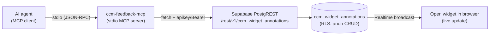
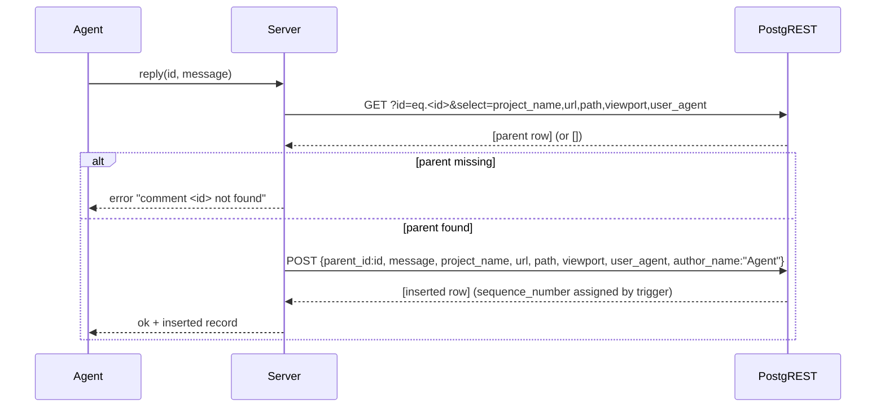

# feat: MCP server — agents read/reply/close comments via PostgREST (Agentation parity)

## Summary

Build a thin, standalone stdio MCP server (`ccm-feedback-mcp`) that lets AI agents
read, reply to, edit, and close ccm-feedback comments live — matching the
competitor's `agentation-mcp`. The server wraps the **existing** Supabase
PostgREST API over `ccm_widget_annotations`. There is **no new backend**:
PostgREST is already a full REST surface (the widget does POST/PATCH/DELETE today),
anon RLS is already permissive full CRUD, and Realtime already pushes writes to
open widgets — so a reply or status flip made by an agent appears in a reviewer's
browser without a refresh.

The server lives in a new `mcp/` subdirectory with its own `package.json`. It
speaks raw PostgREST over `fetch` (no `@supabase/supabase-js`), exactly mirroring
how `src/cloud-store.ts` already authenticates (`apikey` + `Authorization: Bearer
<anon>`). Five tools: `list_comments`, `get_pending`, `update_comment`, `reply`,
`close`. A mocked, assert-based self-check exercises the row-mapping and
payload-building logic with **no live database** required.

Cloud-mode projects only. localStorage projects have no server an MCP can reach —
documented as a follow-up, not solved here.

---

## Problem Frame

The main competitive gap versus Agentation is that they ship `agentation-mcp`, so
agents read, reply to, and resolve annotations live — no copy-paste round-trip.
ccm-feedback already has every backend primitive needed to match it:

- **PostgREST is the API.** `<SUPABASE_URL>/rest/v1/ccm_widget_annotations`
  supports GET/POST/PATCH/DELETE with `eq.`/`is.`/`order=` query operators. The
  widget's `CloudStore` (`src/cloud-store.ts`) and the read-only Netlify function
  (`netlify/functions/feedback.mts`) both already use it.
- **RLS is permissive anon CRUD.** `supabase/migrations/0001_init.sql` (repaired by
  `0005_repair_rls.sql`) grants the anon role full select/insert/update/delete.
- **Realtime already broadcasts writes** (`supabase/migrations/0003_realtime.sql`),
  so agent writes reach open widgets without polling.

The only missing piece is a small protocol adapter: an MCP stdio server that turns
agent tool calls into PostgREST `fetch` requests. The work is a thin wrapper plus
a runnable self-check — not a backend project.

---

## Goal Capsule

Ship `mcp/` — a standalone `ccm-feedback-mcp` npm package: a stdio MCP server
built on `@modelcontextprotocol/sdk` that exposes five tools backed by raw
PostgREST `fetch` calls against the existing `ccm_widget_annotations` table.
Configuration comes from env/args (`SUPABASE_URL`, anon key, project name). A
mocked self-check proves the row-mapping and payload logic without a live
Supabase. The root build/lint/check stays green.

**Done when:** an agent configured with the MCP can (1) list pending comments for
a cloud project, (2) post a reply, (3) edit a comment's message, and (4) flip a
comment's status to `review`; the mocked self-check passes; and root
`bun run check` + `bun run lint` + `bun run build` stay green.

---

## Requirements

- **R1** — A new standalone package lives at `mcp/` with its own `package.json`
  (name `ccm-feedback-mcp`), independent of the root `bun.lock` (NOT a root
  workspace member), so `bun install --frozen-lockfile` at the repo root stays
  valid.
- **R2** — The server uses stdio transport via the official
  `@modelcontextprotocol/sdk`.
- **R3** — Config is read from env/args: `SUPABASE_URL`, anon key
  (`SUPABASE_ANON_KEY`), and a project name (`CCM_FEEDBACK_PROJECT` env or a
  CLI arg). Missing required config fails fast with a clear stderr message.
- **R4** — All data access is raw PostgREST over global `fetch` with the
  `apikey` + `Authorization: Bearer <anon>` header pair (mirroring
  `src/cloud-store.ts:233-238`). No `@supabase/supabase-js` dependency.
- **R5** — Tool `list_comments(project?)` — GET
  `?project_name=eq.<project>&order=created_at.desc`, rows mapped via a
  `rowToRecord` mirror of `netlify/functions/feedback.mts`.
- **R6** — Tool `get_pending(project?)` — GET filtered to `status=eq.todo` AND
  `parent_id=is.null` (top-level, unhandled comments only), `order=created_at.desc`.
- **R7** — Tool `update_comment(id, message?, status?)` — PATCH `?id=eq.<id>`
  with only the supplied fields. At least one of `message`/`status` required.
- **R8** — Tool `reply(id, message)` — POST a new degenerate row with
  `parent_id=<id>`, inheriting `project_name` + `url` (+ `path`, `viewport`,
  `user_agent`) from the parent row (fetched first), satisfying the DB NOT NULL
  on `project_name`/`message`/`url`. Anchor/rect fields blank; NO `status`/`kind`;
  NO `sequence_number` (server trigger assigns it). Mirrors `buildReplyRecord`
  in `src/store.ts:265`.
- **R9** — Tool `close(id)` — PATCH `{status:"review"}`. The agent sets `review`,
  never `done` — `done` is a human-only transition per `src/types.ts:10`.
- **R10** — A runnable assert-based self-check exercises `rowToRecord`, the reply
  payload builder, the update payload builder, and query-string building, with a
  **mocked** global `fetch`. It needs no live Supabase and is wired as the
  `mcp/` package's `test` script.
- **R11** — `mcp/README.md` documents usage (config, agent wiring) and the two
  caveats: cloud-mode-only, and anon-key-in-agent-config / permissive-RLS /
  never-service-role.
- **R12** — Root `bun run check`, `bun run lint`, and `bun run build` stay green.
  New code is confined to `mcp/` (plus, if strictly required, narrowly-scoped
  root wiring called out explicitly).

---

## Key Technical Decisions

### KTD1 — Standalone package, isolated from the root lockfile

`mcp/` gets its own `package.json` and is **not** added as a Bun/npm workspace
member of the root. Rationale: the root CI runs `bun install --frozen-lockfile`,
which fails if `bun.lock` doesn't match `package.json`. Pulling
`@modelcontextprotocol/sdk` into a workspace would mutate the root lockfile and
risk breaking that frozen install. Keeping `mcp/` standalone means the MCP's deps
install only when someone `cd mcp && npm install` (or `bun install`) — the root
build/lint/check never touches them. The root `tsconfig.json` already scopes
`include: ["src/**/*"]`, so `bun run check` (root `tsc --noEmit`) ignores `mcp/`
entirely; `mcp/` carries its own `tsconfig.json`.

### KTD2 — Runtime: TypeScript executed by a runtime, plus its own tsc for type-safety

`mcp/` ships `.ts` source. Two type concerns are kept separate:
- **Type-checking:** `mcp/tsconfig.json` (strict, `exactOptionalPropertyTypes`)
  validates the source. `mcp/`'s own `check` script runs `tsc --noEmit`. This is
  NOT wired into the root `bun run check` (which only sees `src/`), so a live DB
  is never needed for the root gate.
- **Execution:** the published `bin` entry runs the server. Default to a thin
  Node-runnable entry. Because Node cannot run `.ts` directly across all
  supported versions, the package builds to `dist/` via `tsc` (emit on) for its
  `bin`, OR uses a `.mjs` entry — the implementer picks the lowest-friction option
  that keeps `npx ccm-feedback-mcp` working and the self-check runnable. Keep it
  simple: prefer a tsc build to `mcp/dist/` with a `bin` pointing at the built
  `index.js`. (See Open Questions — the runtime choice is a small execution-time
  decision, not a product decision.)

### KTD3 — Biome must stay green on `mcp/`

Root `biome.json` has `files.includes: ["**", ...]`, so Biome lints `mcp/` by
default. `mcp/` source must satisfy: double quotes, semicolons always, trailing
commas all, line width 120, **no `any`** (`noExplicitAny: error`), **no non-null
assertions** (`noNonNullAssertion: error`). The self-check's `fetch` mock must be
typed without `any` and without `!`. Add `mcp/__tests__/**` to the existing Biome
`overrides` block (which already relaxes `noExplicitAny`/`noNonNullAssertion` for
`**/__tests__/**`) — putting the self-check under `mcp/__tests__/` means the
override already covers it; confirm the glob matches. This is the one explicitly
sanctioned root-file edit (see KTD7 / Scope).

### KTD4 — Reuse the `rowToRecord` mapping verbatim from the Netlify function

`netlify/functions/feedback.mts` already holds the canonical snake_case→camelCase
mapping (~25 fields, including `parentId`/`sequenceNumber` linkage). The MCP cannot
cleanly import it (different module/runtime), so `mcp/` carries a hand-copied mirror
— the same duplication the Netlify function itself documents (it mirrors
`src/cloud-store.ts:rowToRecord`). The mirror is small, stable, and covered by the
self-check. Document the "kept in sync by hand" relationship in a code comment, as
the existing files do.

### KTD5 — Reply row shape mirrors `buildReplyRecord`

A reply is a degenerate annotation row: `parent_id` set, anchor/rect fields blank,
no `status`/`kind`. To satisfy the DB NOT NULL on `url`/`project_name`, `reply`
first GETs the parent row (`?id=eq.<id>&select=project_name,url,path,viewport,user_agent`)
and inherits those fields. `message` is the agent input; `author_name` defaults to
a clear agent label (e.g. `"Agent"`). `sequence_number` is **omitted** — the
server-side HWM trigger assigns it (mirrors `recordToRow` in `src/cloud-store.ts`,
which omits it on the regular insert path). If the parent GET returns no row, the
tool returns a clear error rather than inserting an orphan.

### KTD6 — `close` sets `review`, never `done`

Per `src/types.ts:10` (`FeedbackStatus = "todo"|"review"|"done"|"question"`) and
its doc comment, `review` = handled-by-agent / pending-human-verification; `done`
is a human-only flip in the widget. `close(id)` therefore PATCHes
`{status:"review"}`. This is the load-bearing parity-with-the-widget contract.

### KTD7 — Confine changes to `mcp/`; the only root edit is the Biome override glob

All new code lives under `mcp/`. The single sanctioned root-file edit is adding
`mcp/__tests__/**` (or confirming `**/__tests__/**` already matches it) to the
Biome `overrides` block so the self-check's mocked `fetch` can use test-only
relaxations. No widget runtime, Netlify function, or migration is touched. No root
`package.json`/`bun.lock` change.

---

## High-Level Technical Design

### Component / data flow



### Tool → PostgREST request mapping

| Tool | HTTP | PostgREST request (against `/rest/v1/ccm_widget_annotations`) |
| --- | --- | --- |
| `list_comments(project?)` | GET | `?project_name=eq.<p>&order=created_at.desc` → rows mapped via `rowToRecord` |
| `get_pending(project?)` | GET | `?project_name=eq.<p>&status=eq.todo&parent_id=is.null&order=created_at.desc` |
| `update_comment(id, message?, status?)` | PATCH | `?id=eq.<id>` body = supplied fields only |
| `reply(id, message)` | GET then POST | GET parent `?id=eq.<id>&select=project_name,url,path,viewport,user_agent`; POST degenerate row `{parent_id, message, project_name, url, path, viewport, user_agent, author_name}` |
| `close(id)` | PATCH | `?id=eq.<id>` body = `{status:"review"}` |

Auth header (every request): `{ apikey: <anon>, Authorization: "Bearer <anon>", "Content-Type": "application/json" }`. PATCH/POST add `Prefer: "return=representation"` so the tool can return the affected row(s) to the agent.

### `reply` sequence



---

## Output Structure

```text
mcp/
├── package.json          # name: ccm-feedback-mcp; bin; scripts: build, check, test
├── tsconfig.json         # strict + exactOptionalPropertyTypes; emits to dist/ (or noEmit if .mjs entry)
├── README.md             # usage + caveats (R11)
├── .gitignore            # dist/, node_modules/
└── src/
    ├── index.ts          # stdio MCP server: config load, tool registration, dispatch
    ├── postgrest.ts      # fetch wrapper + rowToRecord mirror + payload builders
    └── __tests__/
        └── self-check.ts # node:test + node:assert, mocked fetch (R10)
```

The tree is a scope declaration, not a constraint — the implementer may merge
`postgrest.ts` into `index.ts` if the total stays near the ~150-200 line target.
Keeping the pure functions (`rowToRecord`, payload builders, query-string builder)
in a separate, side-effect-free module is preferred because it makes the mocked
self-check trivial to import.

---

## Implementation Units

### U1. Scaffold the `mcp/` package

**Goal:** Create the standalone package skeleton so subsequent units have a place
to land, with no impact on the root lockfile or root gates.

**Requirements:** R1, R12.

**Dependencies:** none.

**Files:**
- `mcp/package.json` (create) — `name: "ccm-feedback-mcp"`, `"private": false` or
  as appropriate, `type: "module"`, `bin` entry, scripts `build`/`check`/`test`,
  dependency `@modelcontextprotocol/sdk`, devDependency `typescript` (+
  `@types/node`). Pin to currently-published versions.
- `mcp/tsconfig.json` (create) — strict, `exactOptionalPropertyTypes: true`,
  matching repo strictness; `module`/`moduleResolution` suitable for Node ESM.
- `mcp/.gitignore` (create) — `dist/`, `node_modules/`.

**Approach:** Keep `mcp/` out of any root workspace config (KTD1). Do NOT modify
the root `package.json` or `bun.lock`. Verify `bun install --frozen-lockfile` at
the repo root still succeeds untouched after this unit.

**Patterns to follow:** Root `tsconfig.json` strictness flags; root
`package.json` `type: "module"` convention.

**Test scenarios:** Test expectation: none — pure scaffolding/config, no behavior.

**Verification:** From repo root, `bun install --frozen-lockfile` still succeeds;
root `bun run check`/`bun run lint`/`bun run build` unaffected. `cd mcp && (npm|bun) install`
resolves `@modelcontextprotocol/sdk`.

### U2. PostgREST adapter + pure mapping/payload helpers

**Goal:** Implement the side-effect-light data layer: a typed `fetch` wrapper with
the anon-key headers, the `rowToRecord` mirror, and the three payload/query
builders the tools need.

**Requirements:** R4, R5, R6, R7, R8, R9, KTD4, KTD5.

**Dependencies:** U1.

**Files:**
- `mcp/src/postgrest.ts` (create) — exports: `rowToRecord(row)` (mirror of
  `netlify/functions/feedback.mts`), `buildReplyPayload(parentRow, message, author)`
  (mirror of `buildReplyRecord` shape), `buildUpdatePayload({message?, status?})`,
  `buildListQuery({project, pendingOnly})` (query-string builder), and a typed
  `request(endpoint, init)` fetch helper applying `apikey`/`Bearer`/`Content-Type`.
- `mcp/src/types.ts` (create, optional) — the `CloudRow`/record interfaces copied
  from the Netlify function so the mapping is typed without `any`.

**Approach:** Copy the `CloudRow` interface and `rowToRecord` body from
`netlify/functions/feedback.mts` verbatim (KTD4), with a comment noting the
hand-sync relationship. `buildReplyPayload` produces the degenerate row from KTD5
(parent-inherited `project_name`/`url`/`path`/`viewport`/`user_agent`, blank
anchor/rect, no `status`/`kind`/`sequence_number`). `buildUpdatePayload` includes
only supplied keys (`exactOptionalPropertyTypes` — omit, don't set undefined).
All helpers are pure except `request`. No `any`, no `!` (KTD3) — use explicit
types and narrowing.

**Patterns to follow:** `netlify/functions/feedback.mts` (rowToRecord, header
pattern); `src/cloud-store.ts:159` (recordToRow), `:233-238` (headers),
`:564-583` (PATCH `?id=eq.<id>` shape); `src/store.ts:265` (buildReplyRecord).

**Test scenarios:** (covered by U4's self-check, but enumerated here for the
implementer)
- `rowToRecord` maps all snake_case fields to camelCase; `status` defaults to
  `"todo"` and `kind` to `"target"` when null; `parentId`/`sequenceNumber` appear
  only when present; pin/area fields appear only when their full set is non-null.
- `buildReplyPayload` sets `parent_id`, inherits `project_name`/`url`/`path`/
  `viewport`/`user_agent` from the parent, leaves anchor/rect blank, and omits
  `status`/`kind`/`sequence_number`.
- `buildUpdatePayload` includes only supplied keys; `{message}` → `{message}`;
  `{status}` → `{status}`; both → both; neither → caller-rejected (validated in U3).
- `buildListQuery({pendingOnly:true})` includes `status=eq.todo` and
  `parent_id=is.null`; `{pendingOnly:false}` includes neither; both include
  `project_name=eq.<encoded>` and `order=created_at.desc`; project name is
  URL-encoded.

**Verification:** `mcp` `tsc --noEmit` passes; Biome clean; the helpers are
importable by the self-check without invoking real `fetch`.

### U3. stdio MCP server: config, tool registration, dispatch

**Goal:** Wire the five tools onto a stdio MCP server using
`@modelcontextprotocol/sdk`, validating inputs and translating tool calls into
adapter requests.

**Requirements:** R2, R3, R5, R6, R7, R8, R9, KTD5, KTD6.

**Dependencies:** U2.

**Files:**
- `mcp/src/index.ts` (create) — config load (env/args, fail-fast on missing
  `SUPABASE_URL`/anon key, resolve default project), MCP server construction,
  stdio transport, registration of `list_comments`, `get_pending`,
  `update_comment`, `reply`, `close`, each with an input schema and a handler that
  calls the U2 helpers.

**Approach:** Use the SDK's current stdio server + tool-registration API. Each
tool handler: validate args, build the request via U2 helpers, `await request(...)`,
return the representation (PATCH/POST use `Prefer: return=representation`) or a
clear error. `update_comment` rejects when neither `message` nor `status` supplied
(R7) and rejects a `status` value outside the `FeedbackStatus` set; `close` hard-codes
`{status:"review"}` (KTD6); `reply` performs the parent-GET-then-POST flow (KTD5),
erroring if the parent is missing. `project` arg defaults to the configured
project when omitted. Config errors are written to stderr (stdout is the JSON-RPC
channel) and the process exits non-zero.

**Patterns to follow:** `@modelcontextprotocol/sdk` stdio server examples
(current published version); `src/cloud-store.ts` push* methods for request shape
and error logging discipline.

**Technical design (directional, not spec):** tool handlers are thin —
`args → buildXPayload → request → return rows`. Keep validation in the handler,
data shaping in U2.

**Test scenarios:**
- `update_comment` with neither field → validation error (no fetch issued).
- `update_comment` with an out-of-set `status` → validation error.
- `close` always issues PATCH `{status:"review"}` regardless of args.
- `reply` issues GET-parent then POST; missing parent → error, no POST.
- `list_comments`/`get_pending` issue the correct query strings and return mapped
  records.
  (These are exercised by U4 against the mocked `fetch`; handler-level validation
  branches that don't touch `fetch` are asserted directly.)

**Verification:** `npx ccm-feedback-mcp` (or the built `bin`) starts, advertises
the five tools over stdio, and a manual tool call against a real cloud project
performs the expected PostgREST request (manual smoke, not CI).

### U4. Mocked self-check (no live DB)

**Goal:** A runnable, assert-based self-check that proves the row-mapping and
payload/query logic with a mocked global `fetch`, wired as the `mcp` `test`
script and requiring no live Supabase.

**Requirements:** R10, R12, KTD3.

**Dependencies:** U2 (and the validation branches from U3 where reachable without
the SDK transport).

**Files:**
- `mcp/src/__tests__/self-check.ts` (create) — `node:test` + `node:assert`. Stubs
  `globalThis.fetch` with a typed fake that records the URL/method/body and returns
  canned rows. Asserts the U2 helper behaviors enumerated in U2's test scenarios,
  plus: a `reply` flow issues GET-then-POST with the inherited fields; a `close`
  flow issues PATCH `{status:"review"}`; query strings for list/pending are correct
  and URL-encoded.
- Root `biome.json` (modify) — confirm/extend the `overrides` `includes` so
  `mcp/src/__tests__/**` (or `**/__tests__/**`) gets the `noExplicitAny`/
  `noNonNullAssertion` relaxation for the test file (KTD3). This is the single
  sanctioned root edit (KTD7).

**Approach:** Import the pure helpers from `mcp/src/postgrest.ts`. For flows that
need the request layer, install a typed `fetch` mock (a function matching the
`fetch` signature, returning a `Response`-like object) and assert on the captured
request. Use `node:test`'s `t.after`/`beforeEach` to restore `globalThis.fetch`.
Keep the mock typed — no `any`, no `!` outside the test-override glob. Wire
`"test": "node --test"` (or `tsx`/`bun test`, matching KTD2's runtime choice) in
`mcp/package.json`.

**Patterns to follow:** Node's built-in `node:test` runner;
`netlify/functions/feedback.mts` for the expected mapping output to assert against.

**Test scenarios:** This unit *is* the test. It must cover every U2 test scenario
plus the `reply`/`close` request-shape assertions above. The build must NOT depend
on a live Supabase — the mock is the only network surface.

**Verification:** `cd mcp && (npm|bun) test` passes offline; `cd mcp && tsc --noEmit`
passes; root `bun run lint` stays green (Biome clean on `mcp/` including the test
file under the override). Root `bun run check`/`bun run build` unaffected.

### U5. `mcp/README.md` — usage + caveats

**Goal:** Document how to configure and wire the MCP into an agent, and record the
two caveats verbatim from the brief.

**Requirements:** R11.

**Dependencies:** U3 (tool names/signatures finalized).

**Files:**
- `mcp/README.md` (create).

**Approach:** Cover: install (`cd mcp && npm install && npm run build`),
configuration (`SUPABASE_URL`, anon key, project via env/args), an example MCP
client config snippet, the five tools and their args, and how a reply/close shows
up live in an open widget (Realtime). Then a **Caveats** section:
1. **Cloud-mode only** — localStorage projects have no server an MCP can reach; a
   local-HTTP bridge is a separate follow-up (not solved here).
2. **anon key in agent config** — permissive RLS means the key-holder can edit
   *any* project's rows (already true for the widget); flag before multi-tenant
   use. Never use the service-role key with this server.

**Patterns to follow:** Repo `README.md` tone; the security-posture comment block
at the top of `netlify/functions/feedback.mts`.

**Test scenarios:** Test expectation: none — documentation only.

**Verification:** README renders; the two caveats are present and unambiguous; the
config/wiring example is copy-pasteable.

---

## Scope Boundaries

**In scope:** the `mcp/` package (server + adapter + self-check + README); a single
narrowly-scoped Biome override edit (KTD3/KTD7).

**Out of scope (do NOT do here):**
- Any change to the widget runtime (`src/`), the Netlify function, or any
  `supabase/migrations/*` file.
- Any root `package.json` / `bun.lock` change, or adding `mcp/` as a workspace
  member.
- Publishing the package to npm.

### Deferred to Follow-Up Work
- **Local-HTTP bridge for localStorage projects** — localStorage-mode projects
  have no reachable server; an MCP that talks to a local bridge is a separate
  follow-up (documented in README, R11 caveat 1).
- **Per-project / multi-tenant auth hardening** — permissive anon RLS lets a
  key-holder edit any project's rows. Tightening RLS (signed JWTs, per-project
  secrets) is a backend follow-up, not part of this thin wrapper (README caveat 2).
- **Wiring the self-check into root CI** — root `ci.yml` only triggers on PRs to
  `main` and runs root build/lint/check; the `mcp` self-check runs via the `mcp`
  package's own `test` script. A future change could add an `mcp` job.

---

## Open Questions (execution-time, non-blocking)

- **Runtime/build mechanism for the `bin`** (KTD2): tsc-build-to-`dist` vs.
  `.mjs` entry vs. `tsx`. Resolve at implementation time by picking the
  lowest-friction option that keeps `npx ccm-feedback-mcp` working and the
  self-check runnable offline. Does not affect product behavior.
- **Exact published version pins** for `@modelcontextprotocol/sdk` /
  `typescript` / `@types/node`: resolve to currently-published versions at
  implementation time.
- **`author_name` for agent replies**: defaulting to `"Agent"`; could be made
  configurable via env later. Not blocking.

---

## System-Wide Impact

- **Root gates:** unchanged by design (KTD1, KTD7). `mcp/` is invisible to root
  `tsc` (scoped to `src/`) and to `bun install --frozen-lockfile` (standalone
  package). The one root touch is a Biome `overrides` glob extension for the test
  file.
- **Live reviewers:** because Realtime already broadcasts writes, an agent reply
  or `close` made through the MCP appears in any open widget without a refresh —
  no client change needed.
- **Security:** the server uses only the anon key; the service-role key is never
  referenced. The anon-key-in-config exposure is identical to the widget's
  existing posture and is documented (R11).

---

## Verification Contract

1. `cd mcp && (npm|bun) install` resolves dependencies; `tsc --noEmit` passes.
2. `cd mcp && (npm|bun) test` passes **offline** (mocked fetch, no live Supabase).
3. Root `bun run check`, `bun run lint`, `bun run build` all pass; `bun install
   --frozen-lockfile` at root still succeeds.
4. Manual smoke (not CI): with real `SUPABASE_URL` + anon key + a cloud project,
   an agent can `get_pending`, `reply`, `update_comment`, and `close` — and a
   `close` sets status to `review` (verified via `list_comments`).

## Definition of Done

- All of R1–R12 satisfied.
- The five tools behave per the Tool→PostgREST mapping table.
- `close` sets `review` (never `done`); `reply` produces a parent-linked degenerate
  row with no `sequence_number`.
- The mocked self-check passes offline and is wired as the `mcp` `test` script.
- `mcp/README.md` documents usage + both caveats.
- Root build/lint/check stay green; no widget/Netlify/migration files changed.

---

## Sources & Research

- `netlify/functions/feedback.mts` — canonical `rowToRecord`, PostgREST GET shape,
  anon-key header pattern, parentId/sequenceNumber linkage.
- `src/cloud-store.ts:159` `recordToRow`; `:233-238` endpoint + headers; `:564-603`
  `pushUpdate`/`pushDelete` (PATCH/DELETE `?id=eq.<id>`).
- `src/store.ts:265` `buildReplyRecord` — reply row shape.
- `src/types.ts:10` `FeedbackStatus` — `close` → `review`, `done` human-only.
- `supabase/migrations/0001_init.sql` — NOT NULL columns (`project_name`,
  `message`, `url`), permissive anon RLS.
- `biome.json` (`files.includes`, `overrides`), `tsconfig.json` (`include:
  ["src/**/*"]`), `.github/workflows/ci.yml` (triggers on PR to `main` only, runs
  root build/lint/check).

## Product Contract preservation

Direct planning (no upstream brainstorm); `product_contract_source:
ce-plan-bootstrap`. Requirements R1–R12 derived directly from the PRO-197 brief.
