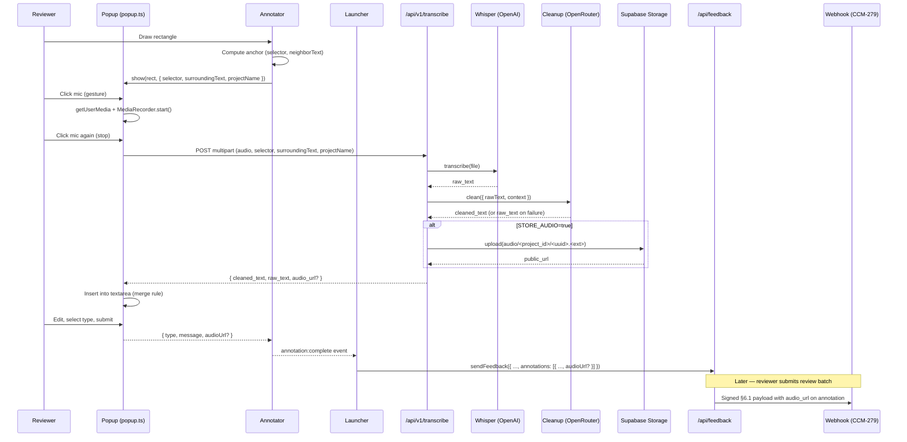

# CCM-284 Voice comment pipeline: Whisper + cleanup

## Overview

This plan lands the P4 voice-dictation pipeline for CCM Feedback. Reviewers press a mic button in the comment composer, record audio in-browser, and receive a cleaned-up transcript inserted into the comment textarea before submission. The server route transcribes audio via Whisper (OpenAI SDK) and post-processes the raw transcript through a cheap cleanup LLM (DeepSeek V3.2 via OpenRouter) using the page context (selector, surrounding text, project name) as grounding to fix filler words, normalize punctuation, and correct obvious misrecognitions.

The pipeline is the adoption driver for non-technical reviewers (spec §4.4 — 3–5x faster than typing). It ships independently of CCM-282 and adds an optional audio persistence path: when `CCM_FEEDBACK_STORE_AUDIO=true`, the server uploads the raw audio blob to the Supabase Storage bucket `audio/<project_id>/<uuid>.webm` and threads an `audio_url` through the `FeedbackAnnotation` record and into the outbound webhook payload from CCM-279.

## Problem Frame

CCM-279 delivered the contract layer (projects, reviews, webhook). CCM-282 (parallel) hardens text editing. Neither addresses the single feature the spec identifies as the primary adoption driver: voice dictation. Without it, non-technical reviewers (the dominant audience) type short, fragmented comments that lose the nuance of how they'd describe feedback verbally — which is where most design critique actually lives.

Three non-mechanical decisions shape the design:

1. **Where the mic UI lives.** The popup composer (`packages/widget/src/popup.ts`) already has textarea + submit/cancel affordances, is the smallest-footprint change, and is already rendered outside Shadow DOM (so `getUserMedia` permissions surface in the normal way). The mic sits beside the submit button in the existing `btnRow`.

2. **Where the cleanup LLM runs.** The spec gives us latitude — Whisper + cleanup in the same route or separated. This plan runs them sequentially in a single `/api/v1/transcribe` route handler so the widget gets one round-trip and the "cleaned text within ~3s on warm path" budget is clear. Whisper returns raw text; the cleanup pass accepts raw text + page context + project name as grounding. If the cleanup call fails, the route still returns `raw_text` so the reviewer never sees a broken feature.

3. **Whether audio persistence is default-on.** No. Voice transcripts alone satisfy the acceptance criteria; persistence is a downstream-agent nice-to-have. The `CCM_FEEDBACK_STORE_AUDIO` env flag gates the upload path, the schema migration adds a nullable `audioUrl` column, and the webhook payload only includes the field when present. This keeps the happy path lean and avoids storage costs until a consumer asks for it.

## Requirements Trace

Every requirement maps to at least one implementation unit and at least one acceptance check.

- **R1.** Widget: mic button rendered inside the popup composer, adjacent to the submit button; hidden (not just disabled) when `navigator.mediaDevices.getUserMedia` is unavailable or the permission is denied.
- **R2.** Widget: pressing the mic toggles a `MediaRecorder` session. WebM/Opus is preferred (`MediaRecorder.isTypeSupported('audio/webm;codecs=opus')`); MP4/AAC (`audio/mp4;codecs=mp4a.40.2`) is the Safari fallback.
- **R3.** Widget: on recorder stop, POST `multipart/form-data` to `${base}/api/v1/transcribe` with fields `audio` (Blob), `selector` (anchor CSS selector), `surroundingText` (neighbor + text snippet), `projectName`.
- **R4.** Widget: while the request is in flight, a "Transcribing..." loading state replaces the mic; other popup interactions (type select, submit) are disabled. On response, the textarea value is *set* to `cleaned_text` (replacing any prior content the user typed only if they have not edited during recording — see Key Technical Decisions for the exact merge rule), focus is restored, and the user can edit before submit.
- **R5.** Server: `POST /api/v1/transcribe` accepts multipart form-data, validates size/mime, calls Whisper via the OpenAI Node SDK with `OPENAI_API_KEY`.
- **R6.** Server: cleanup pass uses a cheap LLM (DeepSeek V3.2 via OpenRouter, `OPENROUTER_API_KEY`). Prompt: strip fillers ("um", "like", "you know"), fix obvious transcription errors using page context as grounding, normalize punctuation.
- **R7.** Server: response is `{ cleaned_text: string, raw_text: string }`. On cleanup failure, `cleaned_text` equals `raw_text` (graceful degradation) and a warning is logged server-side.
- **R8.** Server: when `CCM_FEEDBACK_STORE_AUDIO=true`, upload the raw audio to Supabase Storage bucket `audio/<project_id>/<uuid>.<ext>` (extension derived from mime). Return the resulting public URL as `audio_url` in the transcribe response.
- **R9.** Schema: `FeedbackAnnotation` gains a nullable `audioUrl` column. Both `packages/core/src/schema.ts` and `prisma/schema.prisma` are hand-edited to match; a Prisma migration script under `prisma/migrations/ccm-284-annotation-audio-url/migration.sql` adds the column idempotently.
- **R10.** Webhook: the outbound §6.1 payload includes `audio_url` on each annotation when non-null (absent when null, to preserve payload stability for projects not using voice). The field is added to `WebhookAnnotationPayload` and `buildWebhookPayload` input shape.
- **R11.** Widget composer: the `annotation:complete` event payload gains an optional `audioUrl` so downstream feedback creation persists it. `sendFeedback` / `FeedbackPayload` gain the same optional field.
- **R12.** Acceptance: on the demo, dictating a short utterance produces a cleaned transcription visible in the textarea within ~3 seconds on a warm path (Whisper warm + OpenRouter warm).
- **R13.** Acceptance: fillers removed and punctuation normalized, verified against a known-bad fixture transcript loaded into a unit test.
- **R14.** Acceptance: mic-denied path (user dismisses `getUserMedia` prompt) hides the mic button and leaves the textarea fully functional — no broken UI, no console errors, typed comments still submit.
- **R15.** Acceptance: with `CCM_FEEDBACK_STORE_AUDIO=true`, submitting a voice comment results in a non-null `audio_url` on the resulting `FeedbackAnnotation` row *and* in the outbound webhook payload; with the flag off, the field is absent from both.
- **R16.** Existing tests (`bun run test:run`, `bun run test:e2e`) continue to pass. New tests cover: cleanup prompt fixture, transcribe handler happy path + error paths, widget mic permission-denied state, widget composer insertion-without-overwrite behavior.

## Scope Boundaries

- No live streaming transcription — the widget records, stops, then posts the full blob. Streaming is deferred until volume data shows it matters.
- No waveform visualization / audio level meter — a simple recording indicator (pulsing red dot) is sufficient for the MVP.
- No client-side resampling or compression — the browser's native MediaRecorder output is sent as-is. Whisper accepts WebM/Opus and MP4/AAC directly; size is small for short dictations.
- No multi-language selection UI — the cleanup prompt is English-only in this iteration. Whisper autodetects language so the raw transcript may be non-English, but cleanup prompting assumes English fillers/punctuation conventions.
- No audio playback UI in the reviewer panel — the `audio_url` is data the implementation agent may render but the widget does not surface a player.
- No self-hosted Whisper (`whisper.cpp`). The OpenAI API is the only transcription backend. Swapping providers is a follow-up.
- No voice for non-dictation inputs (search, project name, etc.).
- No CCM-282 scope (image swap, text edit modes).
- No per-annotation voice re-record — once inserted, the text is text.
- No retry queue for failed transcribes (the widget surfaces the error inline and the reviewer can retry by pressing mic again).

### Deferred to Separate Tasks

- **Multilingual cleanup prompt variants**: when we have a French or Spanish reviewer in production, add locale-aware prompt templates. The cleanup LLM generalizes reasonably without this, so it's not blocking.
- **Audio playback in reviewer panel**: a small audio player widget on annotations with `audio_url`. Deferred to a panel-UX ticket.
- **Storage bucket lifecycle policies** (TTL, size caps, signed URLs): the default bucket in this ticket uses public URLs and no expiry. Harden in a follow-up once we have data on volume.
- **Streaming transcription**: deferred until the 3s warm-path target becomes a bottleneck.
- **Per-project rate limiting on `/api/v1/transcribe`**: add via Netlify edge middleware or Cloudflare in a follow-up if abuse appears. For now, the route is open (like `/api/feedback`) and depends on the shared API-key pattern.

## Context & Research

### Relevant Code and Patterns

- **Handler factory convention**: `packages/adapter-prisma/src/review-handler.ts` (`createReviewsHandler`) is the nearest match — a handler factory that takes stores + optional `fetch` for tests and returns `(Request) => Promise<Response>`. The new `createTranscribeHandler` factory in `packages/adapter-prisma/src/transcribe-handler.ts` mirrors this shape. Exported from `packages/adapter-prisma/src/index.ts`.
- **Next.js route pattern**: `apps/demo/src/app/api/v1/reviews/route.ts` (9 lines) — resolves stores, instantiates handler, delegates. `apps/demo/src/app/api/v1/transcribe/route.ts` follows the same shape.
- **Schema source of truth**: `packages/core/src/schema.ts` (`CCM_FEEDBACK_MODELS.FeedbackAnnotation`) and `prisma/schema.prisma` are hand-synced. CCM-287 is a planned follow-up for drift-guard; until then edits land in both places.
- **Prisma migration convention**: `prisma/migrations/ccm-279-projects-and-annotations/migration.sql` — SQL migration folder per ticket. CCM-279 established `ADD CONSTRAINT` idempotence via `IF NOT EXISTS` / guarded ALTERs (see commit `39adade`). CCM-284's migration follows that pattern: `ALTER TABLE "FeedbackAnnotation" ADD COLUMN IF NOT EXISTS "audioUrl" TEXT;`.
- **Webhook payload builder**: `packages/core/src/webhook/payload.ts` — `WebhookAnnotationPayload` interface + `buildWebhookPayload` function. Extending it adds `audio_url?: string` to the output type and a matching `audioUrl?: string | null` input on the builder.
- **Canonicalization**: `packages/core/src/webhook/canonicalization.ts` handles stable key-sorted JSON. Adding an optional field is safe (absent keys do not appear; present keys sort into their alphabetical position). Existing canonicalization tests assert stability — add a fixture with and without `audio_url`.
- **Popup composer**: `packages/widget/src/popup.ts` — current composer with typeRow + textarea + btnRow. Mic button inserts into a new affordance zone above the textarea (doesn't disrupt the existing grid layout) or as a leading icon in `btnRow`. Plan picks `btnRow` to keep visual density low.
- **Annotator → launcher wiring**: `packages/widget/src/annotator.ts` calls `popup.show(rect)` and returns `{ type, message }`. Extended to return `{ type, message, audioUrl? }` so the launcher can pass `audioUrl` into `sendFeedback`.
- **FeedbackPayload type**: `@ccm-feedback/core` — the top-level payload has per-annotation fields. Adding `audioUrl?: string` extends the type used by `StoreClient`, `ApiClient`, and `PrismaStore.createFeedback`.
- **Supabase admin client**: `apps/demo/src/lib/supabase/admin.ts` — existing `createSupabaseAdminClient()` returns a service-role client. This plan uses it for Storage uploads (service role bypasses RLS, which is correct for internal bucket writes).
- **Env + config pattern**: the `apps/demo/.env.example` file documents every env var CCM-279 added. CCM-284 appends `OPENAI_API_KEY`, `OPENROUTER_API_KEY`, `CCM_FEEDBACK_STORE_AUDIO`, `SUPABASE_AUDIO_BUCKET` (default `"audio"`).
- **Tests layout**: `packages/adapter-prisma/__tests__/` for handler tests, `packages/widget/__tests__/` for DOM/composer tests, `apps/demo/src/app/api/v1/*/route.test.ts` is not a pattern used here (demo tests live via e2e). Add `packages/adapter-prisma/__tests__/transcribe-handler.test.ts` and `packages/widget/__tests__/widget/popup-mic.test.ts`.
- **Dependency injection for tests**: `createReviewsHandler` accepts optional `fetch` for tests. The new transcribe handler accepts optional `openai`, `cleanupClient`, `storage` deps so tests never touch real network.

### Institutional Learnings

- `docs/solutions/` does not exist. The two prior plans (`2026-04-20-001-*`, `2026-04-20-002-*`) are the style reference: handler factory + Next route thin-wrapper; schema edits in both `schema.ts` and `schema.prisma`; tests use injected deps rather than network mocks; CI verification lives in the last unit.
- CCM-279 established the `OPTIONS`/`POST` CORS pattern for widget-facing routes. The transcribe route is widget-facing, so it needs the same allowedOrigins treatment when `apiKey` is set.
- CCM-279 established a plaintext-secret-in-process cache pattern (`registerSigningSecret`/`forgetSigningSecret`). Nothing in CCM-284 needs cached secrets — env vars are sufficient — so no new caching layer.
- Bun install handles new `openai` and optional `@supabase/storage-js` deps without hooks. Only Biome + TypeScript type-check gates block CI.

### External References

- **OpenAI Node SDK (Whisper)**: `openai` package `v4+` — `client.audio.transcriptions.create({ file, model: 'whisper-1' })` accepts a `File` or `Blob` directly. For multipart form-data coming in via `request.formData()`, the `File` is already a `File` object on Node 20+. The SDK handles multipart serialization internally. https://platform.openai.com/docs/api-reference/audio/createTranscription
- **OpenRouter + DeepSeek V3.2**: OpenRouter exposes an OpenAI-compatible chat completions endpoint at `https://openrouter.ai/api/v1/chat/completions`. Model slug `deepseek/deepseek-chat-v3.2` (check current slug at request time — OpenRouter rotates). Cleanup can reuse the `openai` SDK by pointing `baseURL` at OpenRouter and setting `apiKey` to `OPENROUTER_API_KEY`. This keeps one SDK dependency and one HTTP shape.
- **MediaRecorder browser compatibility**: Chrome 49+, Firefox 29+, Safari 14.1+ support MediaRecorder; Safari needs `audio/mp4;codecs=mp4a.40.2` or falls back. iOS Safari requires a user gesture to call `getUserMedia`. The mic button click is the gesture — no need to prime elsewhere.
- **MDN MediaRecorder guide**: https://developer.mozilla.org/en-US/docs/Web/API/MediaRecorder — cover stop/dataavailable event pattern and `MediaStreamTrack.stop()` cleanup to release the mic LED.
- **Supabase Storage JS**: `@supabase/supabase-js` includes a `storage` client. `supabase.storage.from('audio').upload(path, blob, { contentType, upsert: false })` returns `{ data, error }`; `getPublicUrl(path)` builds the durable URL. Bucket must exist with the name chosen via `SUPABASE_AUDIO_BUCKET` (default `audio`).
- **Permissions API**: `navigator.permissions.query({ name: 'microphone' })` lets us detect denied state without prompting, so the button can be hidden immediately on load where supported. Fallback to "show-then-hide-on-error" on browsers that don't support it (Safari).

### External Prior Art Notes

- **OpenAI-compatible SDK pattern for multiple providers**: LangChain, Vercel AI SDK, and many OSS projects reuse the `openai` SDK pointed at arbitrary `baseURL`s. This plan does the same — one `openai` package, two clients (Whisper at api.openai.com, cleanup at openrouter.ai). Avoids dragging in a second SDK for one chat call.
- **Multipart form-data in Next.js App Router route handlers**: `await request.formData()` is the supported shape. The returned `FormData` yields `File` objects for blob fields; `size` and `type` (mime) are accessible. No need for `multer` / `formidable`.

## Key Technical Decisions

- **Mic UI placement: inside `popup.ts` button row.**
  - The mic is a small icon button positioned leading in `btnRow` (left of Cancel), so it reads as a modifier on the composer rather than a primary action. Submit remains the rightmost, most prominent affordance.
  - **Why not a toolbar above the textarea**: adds vertical height, breaks existing 300px width / ~220px height budget used by the popup's collision-flip logic.
  - **Why not in the annotator toolbar (top bar)**: that toolbar is active during drawing; the composer is where the user is already typing or thinking about what to say.

- **Permission-denied handling: hide, don't disable.**
  - On popup open (not on widget init — permission state can change between sessions), query `navigator.permissions.query({ name: 'microphone' })`. If `state === 'denied'`, do not render the mic button at all.
  - If the Permissions API is unavailable (Safari), render the button; when the user clicks and `getUserMedia` rejects with `NotAllowedError`, remove the button for the remainder of this popup lifetime and fall back to typed input.
  - **Why hide vs disable**: the ticket explicitly requires "hidden when permission is denied" — users should not be nudged toward something that won't work. A disabled button invites a click that produces a prompt that was already answered.

- **Transcribe single-route vs two-route design: single route.**
  - `POST /api/v1/transcribe` runs Whisper, then cleanup, then returns both strings in one response. Minimizes widget round-trips (single "Transcribing..." spinner, single failure point).
  - **Why not two routes** (`/whisper` + `/cleanup`): doubles network RTT, splits error surface, makes the 3s warm-path target harder. Each call is short; chaining them server-side keeps total latency predictable.
  - **Why return both `raw_text` and `cleaned_text`**: debugging and graceful degradation. If cleanup fails mid-deploy, the widget still has something useful. And the raw text is worth keeping in logs for prompt iteration.

- **Cleanup prompt shape (directional, not implementation):**
  - System message frames role: "You are a transcription cleanup assistant. You receive a raw speech-to-text transcript and page context. Your job: remove disfluencies, normalize punctuation, fix obvious transcription errors where the page context makes the intent clear. Preserve meaning, do not embellish, do not add content, do not interpret or rewrite for clarity. Return the cleaned transcript as plain text with no quotes or framing."
  - User message: `{ raw_text, project_name, selector, surrounding_text }` formatted as a small structured block so the model can distinguish context from content.
  - Temperature: 0.2 (low — we want stability, not creativity).
  - Model: `deepseek/deepseek-chat-v3.2` via OpenRouter. Swapping models is a config change, not code.

- **Graceful degradation on cleanup failure.**
  - If the cleanup call throws/times out (>2s), the handler catches, logs a warning, and returns `{ cleaned_text: raw_text, raw_text }`. The widget is none the wiser; the user sees Whisper's output instead of the cleanup output — acceptable floor behavior.

- **Merge rule for inserting cleaned text into the textarea.**
  - If the textarea is empty when the response arrives, set `textarea.value = cleaned_text`.
  - If the textarea has content that the user typed *before* starting the recording, append `cleaned_text` with a separator space.
  - If the user typed *during* recording (detected via an `input` event listener attached at record start and removed at stop), append with a space — never overwrite user keystrokes.
  - After insertion, move caret to end and dispatch an `input` event so the submit button's enabled-state computation re-runs.

- **Audio persistence: off by default, opt-in via env flag.**
  - `CCM_FEEDBACK_STORE_AUDIO=true` is the gate. When unset or anything other than `"true"`, the server skips upload and omits `audio_url` from the response.
  - Storage target: Supabase Storage bucket (default name `audio`, overridable via `SUPABASE_AUDIO_BUCKET`). Path: `<project_id>/<uuid>.<ext>` where `<ext>` is `webm` or `mp4` derived from the uploaded mime. The uuid is generated server-side (`crypto.randomUUID()`) so clients can't collide.
  - Uploads use the service-role client (already wired in `apps/demo/src/lib/supabase/admin.ts`). RLS is bypassed for this internal write.
  - Public URL is resolved via `getPublicUrl(path)` — bucket must be configured public. A future hardening ticket can switch to signed URLs.
  - **Why not always store**: privacy, storage cost, and because the use case (downstream agent wants audio) is not universal. Most projects will run with it off.

- **Schema + webhook field: `audioUrl` / `audio_url` threaded through end-to-end.**
  - `FeedbackAnnotation.audioUrl String?` in `schema.ts` and `schema.prisma`.
  - `AnnotationPayload.audioUrl?: string` in `@ccm-feedback/core` types.
  - `WebhookAnnotationPayload.audio_url?: string` in `packages/core/src/webhook/payload.ts`.
  - `buildWebhookPayload` passes through when present; omits when absent (no `null` in the payload — absence is the signal).
  - `createFeedback` in `PrismaStore` writes `audioUrl` when the incoming annotation includes it.

- **Dependency set: one new package.**
  - Add `openai` to `packages/adapter-prisma/dependencies` (peer-compatible; Node runtime only). Used for both Whisper and OpenRouter calls via two differently-configured client instances.
  - Supabase storage is already reachable via `@supabase/supabase-js` — no new dep.
  - **Why put `openai` in `adapter-prisma`**: the transcribe handler lives there. The widget does not import `openai` (browser bundle stays lean). The dep is a normal prod dep, not peer.

- **Test doubles: inject dependencies at the handler factory.**
  - `createTranscribeHandler({ whisper, cleanup, storage?, logger? })` where `whisper` is a `{ transcribe(file): Promise<string> }` interface, `cleanup` is `{ clean({ rawText, context }): Promise<string> }`, and `storage` is `{ upload(path, blob, mime): Promise<string> }`.
  - Production wiring in `apps/demo/src/app/api/v1/transcribe/route.ts` constructs real adapters from env vars. Tests construct deterministic fakes.
  - Benefit: every test path (happy, Whisper error, cleanup error, storage error, flag off, flag on) is exercisable without network.

## Open Questions

### Resolved During Planning

- **Do we need a separate endpoint for audio-only submission (no transcription)?** No. The ticket scope is dictation-to-text. Audio persistence is a side-effect of that flow when the flag is on.
- **Do we enforce a max audio duration/size?** Yes. Server enforces 5MB max upload size and 60s max duration (approximated by 5MB at Opus bitrates). Widget-side, the UI softly caps at 60s by auto-stopping the recorder. Rejections return a 413 with a clear error.
- **How does the widget discover the transcribe URL?** Same as `submitReview` in CCM-279 — derive `${base}/api/v1/transcribe` by stripping `/api/feedback` from the widget `endpoint` config. Keeps one config surface.
- **Does the cleanup LLM see the full neighbor_text or just the snippet?** Full neighbor + text snippet (already captured at annotation time; just not carried across yet). The anchor is not yet generated when the popup is open — we only have the drawing-rect pointer at that moment. Plan: the annotator computes the anchor before opening the popup, and passes `selector` + `surroundingText` into `popup.show()`.
- **Does the mic work in the keyboard-annotation path (Enter selects focused element)?** Yes — the keyboard path also calls `popup.show(rectBounds)`, so the same context is available. No separate wiring needed.

### Deferred to Implementation

- **Exact OpenRouter model slug at merge time**: OpenRouter sometimes rotates DeepSeek slugs; pick the correct current slug at implementation time and pin via env var `CCM_CLEANUP_MODEL` with a default.
- **Final placement/styling of the mic icon**: pixel-level decisions (size, spacing, color for recording state) settle in implementation; the structural decision (inside btnRow) is fixed here.
- **Whisper prompt hints**: the OpenAI SDK accepts an optional `prompt` field that biases transcription toward certain terms (project names, proper nouns). Whether we pass `projectName` as a transcription hint *in addition to* using it in cleanup is worth empirical checking at implementation time.
- **Whether to send `Content-Language` or similar metadata**: if Whisper auto-detection is reliable enough, we skip. If not, the widget can send `navigator.language` as a hint.

## High-Level Technical Design

> *This illustrates the intended approach and is directional guidance for review, not implementation specification. The implementing agent should treat it as context, not code to reproduce.*

## Implementation Units

- [x] **Unit 1: Schema + type plumbing for `audioUrl`**

**Goal:** Thread `audioUrl` from schema through the core types and Prisma store so every other unit can use it.

**Requirements:** R9, R11

**Dependencies:** None

**Files:**
- Modify: `packages/core/src/schema.ts` (add `audioUrl` to `FeedbackAnnotation.fields`)
- Modify: `prisma/schema.prisma` (add `audioUrl String?`)
- Create: `prisma/migrations/ccm-284-annotation-audio-url/migration.sql` (idempotent `ADD COLUMN IF NOT EXISTS`)
- Modify: `packages/core/src/types.ts` (add `audioUrl?: string` to `AnnotationPayload` and `FeedbackCreateInput.annotations[n]`)
- Modify: `packages/adapter-prisma/src/index.ts` (pass `audioUrl` through in `createFeedback`)
- Modify: `packages/adapter-prisma/src/validation.ts` (add `audioUrl: z.string().url().optional()` to annotation schema)
- Test: `packages/adapter-prisma/__tests__/handler.test.ts` (extend existing fixture with an `audioUrl` case)

**Approach:**
- Keep the column nullable and optional throughout — no breaking change for existing clients.
- Migration SQL uses `ALTER TABLE "FeedbackAnnotation" ADD COLUMN IF NOT EXISTS "audioUrl" TEXT;` so re-runs are safe (mirrors CCM-279 idempotent style).
- Zod validator accepts `string().url()` to catch garbage input; no validation for specific storage host — the route that writes it is already trusted.

**Patterns to follow:**
- `packages/core/src/schema.ts` existing `implementationResult: Json?, optional: true` field shape for optionals.
- CCM-279 migration idempotence (commit `39adade`).

**Test scenarios:**
- Happy path: POST `/api/feedback` with an annotation including `audioUrl` persists it and returns it on GET.
- Happy path: POST without `audioUrl` still works and the field reads back as `null`.
- Edge case: invalid `audioUrl` ("not-a-url") returns 400 with a Zod validation error.
- Integration: flatten + hydrate round-trip preserves `audioUrl` (exercises `flattenAnnotation`).

**Verification:**
- `bun run check` passes with no type errors across all packages.
- Running the migration twice in a row against a fresh Postgres is a no-op on the second run.

---

- [x] **Unit 2: Webhook payload field `audio_url`**

**Goal:** Add `audio_url` to the outbound §6.1 webhook payload so the implementation agent sees voice comments.

**Requirements:** R10

**Dependencies:** Unit 1

**Files:**
- Modify: `packages/core/src/webhook/payload.ts` (add `audio_url?: string` to `WebhookAnnotationPayload` + optional `audioUrl` to `WebhookPayloadBuilderInput.annotations[n]`)
- Modify: `packages/adapter-prisma/src/review-dispatch.ts` (pass `audioUrl` through when building the payload from annotation rows)
- Test: `packages/core/__tests__/webhook-payload.test.ts` (may need creating if missing)
- Test: `packages/core/__tests__/webhook-canonicalization.test.ts` (add fixture with `audio_url` — confirm canonical serialization is stable with/without it)

**Approach:**
- Use conditional spread in `buildWebhookPayload` (`...(ann.audioUrl ? { audio_url: ann.audioUrl } : {})`) matching the pattern already used for `element_id` and `email`. This keeps the payload shape identical for projects that don't use voice.
- Canonicalization is unchanged — key-sorted JSON automatically places `audio_url` alphabetically.

**Patterns to follow:**
- `WebhookAnnotationAnchor.element_id` conditional spread in existing `buildWebhookPayload`.

**Test scenarios:**
- Happy path: annotation with `audioUrl` produces a payload that serializes with `"audio_url":` in the correct alphabetical position.
- Happy path: annotation without `audioUrl` produces a payload with no `audio_url` key.
- Edge case: canonicalization bytes are identical for a payload WITHOUT `audio_url` before and after this change (regression guard — add a stored canonical-bytes fixture if not already present).
- Integration: HMAC signature computed over the new payload shape verifies successfully via the existing `scripts/verify-webhook-signature.mjs`.

**Verification:**
- `bun run test:run` passes, including the new canonicalization fixture.

---

- [x] **Unit 3: Server route — `/api/v1/transcribe` handler factory**

**Goal:** Ship the multipart-accepting, Whisper + cleanup + (optional) storage handler as a factory in `adapter-prisma`.

**Requirements:** R5, R6, R7, R8

**Dependencies:** Unit 1 (type plumbing optional here, but needed by Unit 6)

**Files:**
- Create: `packages/adapter-prisma/src/transcribe-handler.ts`
- Create: `packages/adapter-prisma/src/transcribe-clients.ts` (thin Whisper + Cleanup + Storage adapters over the `openai` and `@supabase/supabase-js` SDKs)
- Modify: `packages/adapter-prisma/src/index.ts` (export `createTranscribeHandler`, `createWhisperClient`, `createCleanupClient`, `createAudioStorage`)
- Modify: `packages/adapter-prisma/package.json` (add `openai` dependency; `@supabase/supabase-js` already transitively available via demo, but add explicit peer or prod dep if not)
- Test: `packages/adapter-prisma/__tests__/transcribe-handler.test.ts`

**Approach:**
- `createTranscribeHandler({ whisper, cleanup, storage?, maxAudioBytes = 5_000_000, allowedMimes = ['audio/webm', 'audio/mp4'], logger? })` returns `async (request: Request) => Response`.
- Handler flow: parse `formData()`, validate `audio` File presence + size + mime, read `selector`, `surroundingText`, `projectName` as strings, call `whisper.transcribe(file)`, pass result through `cleanup.clean({ rawText, context })`, optionally upload via `storage.upload(projectId, uuid, file)` (requires a `projectId`; fall back to `projectName` if no id resolver is provided — see note below).
- Return JSON `{ cleaned_text, raw_text, audio_url? }` with 200.
- Error paths: 400 on missing fields / bad mime / too large; 502 when Whisper throws; 200 with `cleaned_text === raw_text` when only cleanup throws (graceful); 500 with logged error for storage failures *when flag is on* (do not swallow — if the feature is opted in, a failure should surface).
- **Project id resolution**: the widget knows `projectName` (the public field) but not `projectId` (internal UUID). The handler resolves it via an optional injected `projectStore` dependency (same `ProjectStore` as CCM-279). If unset, it falls back to using `projectName` as the path segment. This keeps the handler testable without a DB and keeps the public API stable.
- Cleanup calls a prompt constant defined beside the handler (`CLEANUP_SYSTEM_PROMPT`). The prompt lives in a constants file so the test fixture can import it and run expected input/output comparisons.

**Patterns to follow:**
- `createReviewsHandler` shape in `packages/adapter-prisma/src/review-handler.ts` (factory, injected deps, plain async `(Request) => Response`).
- `formatValidationErrors` helper for error responses.
- `openai` SDK `audio.transcriptions.create({ file, model: 'whisper-1' })` for transcription; `chat.completions.create({ model, messages, temperature: 0.2 })` pointed at `baseURL: 'https://openrouter.ai/api/v1'` for cleanup.

**Test scenarios:**
- Happy path: multipart with valid audio blob + context returns `{ cleaned_text, raw_text }` where `cleaned_text` is the fake-cleanup output.
- Happy path with storage: flag-on (storage dep provided) returns `audio_url` pointing at the fake storage URL.
- Happy path without storage: flag-off (no storage dep) omits `audio_url`.
- Edge case: missing `audio` field returns 400 with a clear validation error.
- Edge case: oversized blob (>5MB) returns 413.
- Edge case: unsupported mime (`audio/ogg` not in allowlist) returns 415.
- Error path: Whisper throws — handler returns 502 with message; no partial data leaks.
- Error path: cleanup throws — handler returns 200 with `cleaned_text === raw_text` and logs a warning.
- Error path: storage throws when flag is on — handler returns 500 with message (does not silently drop).
- Integration: handler constructs correct prompt input (context object shape) to the injected `cleanup` dep — assert via spy.

**Verification:**
- `bun run test:run` passes; coverage for the new handler is comprehensive (all branches).
- The fake `whisper` adapter returns a known-bad fixture; the fake `cleanup` adapter returns an expected-cleaned string; the test asserts exact strings.

---

- [x] **Unit 4: Known-bad fixture + cleanup prompt regression test**

**Goal:** Prove the cleanup prompt shape removes fillers and normalizes punctuation — the ticket's explicit acceptance criterion.

**Requirements:** R13

**Dependencies:** Unit 3

**Files:**
- Create: `packages/adapter-prisma/__tests__/fixtures/cleanup-known-bad.json` (raw -> expected pairs)
- Create: `packages/adapter-prisma/__tests__/cleanup-prompt.test.ts`
- Modify: `packages/adapter-prisma/src/transcribe-handler.ts` (extract `buildCleanupMessages({ rawText, context })` so the test can assert message construction without running an LLM)

**Approach:**
- Fixture covers: filler words ("um", "uh", "like", "you know"), missing punctuation, obvious mis-transcription that the page context should correct (e.g., raw "the butan doesn't work" with a selector pointing to `<button>` -> cleaned "the button doesn't work").
- Two test tiers:
  1. **Message construction** (always runs): asserts `buildCleanupMessages` produces the expected messages array given fixture input. No LLM call.
  2. **Live cleanup** (opt-in via `CCM_TEST_LIVE_LLM=1`): actually calls OpenRouter with the real prompt and asserts fillers-gone / punctuation-correct. Skipped in CI by default; documented in `docs/local-dev.md`.

**Patterns to follow:**
- `packages/adapter-prisma/__tests__/fixtures.ts` existing fixture style.

**Test scenarios:**
- Happy path (message construction): raw_text + context -> messages array with system + user messages in expected order, `temperature: 0.2`, correct model slug.
- Happy path (message construction): page-context fields are stringified into the user message in a way that the LLM can parse (assert substring).
- Edge case: empty `surroundingText` and `selector` still produces valid messages (LLM receives empty context strings, doesn't crash).

**Verification:**
- Message-construction tier passes in CI without any network.
- Live tier, when run locally, produces cleaned text matching expected pairs.

---

- [x] **Unit 5: Next.js route + env wiring**

**Goal:** Expose the transcribe handler as `/api/v1/transcribe` in the demo app with real adapters.

**Requirements:** R5, R8 (env wiring)

**Dependencies:** Unit 3

**Files:**
- Create: `apps/demo/src/app/api/v1/transcribe/route.ts`
- Modify: `apps/demo/.env.example` (document `OPENAI_API_KEY`, `OPENROUTER_API_KEY`, `CCM_CLEANUP_MODEL`, `CCM_FEEDBACK_STORE_AUDIO`, `SUPABASE_AUDIO_BUCKET`)
- Modify: `apps/demo/src/lib/supabase/admin.ts` (if needed — existing client already returns service-role; confirm bucket access works)

**Approach:**
- Route file is a thin wrapper (CCM-279 convention) — construct Whisper, Cleanup, and (conditional) Storage adapters from env, wire up `projectStore` from `resolveProjectStores`, and delegate to `createTranscribeHandler`.
- `runtime = "nodejs"` + `dynamic = "force-dynamic"` (same as other v1 routes — File/multipart parsing and the `openai` SDK both need Node).
- When `CCM_FEEDBACK_STORE_AUDIO !== "true"`, pass no `storage` to the handler.
- When set, construct `createAudioStorage({ supabase: createSupabaseAdminClient(), bucket: process.env.SUPABASE_AUDIO_BUCKET ?? "audio" })`.

**Patterns to follow:**
- `apps/demo/src/app/api/v1/reviews/route.ts` (thin wrapper pattern).
- `apps/demo/src/app/api/v1/annotations/[id]/status/route.ts` (conditional env-based dep injection).

**Test scenarios:**
- Test expectation: none — the route file is a thin wrapper. Coverage lives at the handler level (Unit 3) and E2E level (Unit 8).

**Verification:**
- `apps/demo` builds with the new route in `next build`.
- With real env vars set and a small fixture audio file, `curl -F audio=@fixture.webm -F projectName=demo -F selector=h1 -F surroundingText="Our approach" https://localhost:3999/api/v1/transcribe` returns `{ cleaned_text, raw_text }`.

---

- [x] **Unit 6: Widget composer — mic button + MediaRecorder + permission handling**

**Goal:** Ship the mic affordance inside the popup composer with clean permission-denied behavior.

**Requirements:** R1, R2, R14

**Dependencies:** None structurally; merges with Unit 7 at integration time.

**Files:**
- Modify: `packages/widget/src/popup.ts` (add mic button to `btnRow`; add `AudioRecorder` helper class inline or import; add `isMicAvailable()` gate; track recording state)
- Create: `packages/widget/src/audio-recorder.ts` (thin wrapper over MediaRecorder with `start()`, `stop(): Promise<Blob>`, cleanup)
- Modify: `packages/widget/src/icons.ts` (add `ICON_MIC` and `ICON_MIC_ACTIVE` or a single mic + red-dot overlay)
- Modify: `packages/widget/src/i18n/en.ts` and `packages/widget/src/i18n/fr.ts` (add `popup.mic.record`, `popup.mic.stop`, `popup.mic.recording`, `popup.mic.transcribing`, `popup.mic.error`)
- Test: `packages/widget/__tests__/widget/popup-mic.test.ts`

**Approach:**
- `AudioRecorder` class: picks best mime via `MediaRecorder.isTypeSupported` precedence (`audio/webm;codecs=opus` > `audio/webm` > `audio/mp4;codecs=mp4a.40.2` > `audio/mp4`). If none match, `isSupported()` returns false.
- On mic-button click: call `getUserMedia({ audio: true })`. If it rejects with `NotAllowedError`, hide the button and clear state. If it succeeds, create MediaRecorder, collect `dataavailable` blobs, start.
- On second click (recorder active): stop recorder, collect final blob, release tracks (`stream.getTracks().forEach(t => t.stop())`), set state to "transcribing", emit a `transcribe-request` callback to the popup's owner (popup itself owns the transcribe call — see Unit 7).
- Permission probe on `popup.show()`: `navigator.permissions?.query({ name: 'microphone' })` and hide the button when `state === 'denied'`.
- Max-duration safety: setTimeout 60s auto-stops recorder (prevents accidental runaway).

**Patterns to follow:**
- `packages/widget/src/annotator.ts` event lifecycle (activate/deactivate symmetric pairs).
- `packages/widget/src/dom-utils.ts` for element creation consistency.
- `packages/widget/src/icons.ts` constant SVG string pattern.

**Test scenarios:**
- Happy path: `isSupported()` returns true when `MediaRecorder` is available on jsdom via a stub; mic button renders.
- Happy path: clicking mic calls `getUserMedia` (stubbed), starts the recorder, UI flips to "recording" state.
- Happy path: second click stops recorder, produces a Blob, UI flips to "transcribing".
- Edge case: `MediaRecorder` undefined (old browser stub) — button is not rendered, textarea is functional.
- Edge case: `navigator.permissions.query` returns `'denied'` — button is not rendered, no `getUserMedia` is called.
- Error path: `getUserMedia` rejects with `NotAllowedError` — button is removed, typed comment still submits.
- Error path: recorder throws on start — button returns to idle state, error message announced via existing ARIA live region pattern.
- Integration: recording, then cancel-popup, releases the MediaStream (assert `track.stop` was called) — no mic-LED-left-on bugs.

**Verification:**
- Playwright-friendly jsdom tests pass.
- Manual smoke on Chrome + Safari: mic LED lights on record, extinguishes on stop/cancel.

---

- [ ] **Unit 7: Widget — transcribe round-trip + textarea insertion**

**Goal:** Wire the recorded blob through the new `/api/v1/transcribe` endpoint and insert cleaned text into the textarea with the correct merge rule.

**Requirements:** R3, R4

**Dependencies:** Unit 3 (server route must exist or be stubbable), Unit 6

**Files:**
- Modify: `packages/widget/src/popup.ts` (transcribe call on recorder stop; "Transcribing..." state; textarea merge)
- Modify: `packages/widget/src/api-client.ts` (add `transcribe({ audioBlob, selector, surroundingText, projectName }): Promise<{ cleaned_text, raw_text, audio_url? }>` to `ApiClient`; add optional `transcribe?` to `WidgetClient` interface)
- Modify: `packages/widget/src/annotator.ts` (compute and forward `selector` + `surroundingText` when invoking `popup.show`)
- Modify: `packages/widget/src/popup.ts` (accept `PopupContext = { selector, surroundingText, projectName }` in `show()`; pass through to the transcribe helper; return `{ type, message, audioUrl? }`)
- Modify: `packages/widget/src/launcher.ts` (pass `projectName` into the annotator so it can thread it into popup context; propagate `audioUrl` onto the `FeedbackPayload`)
- Test: `packages/widget/__tests__/widget/popup-mic.test.ts` (extend)

**Approach:**
- `ApiClient.transcribe` builds FormData (audio Blob + strings), POSTs to `${base}/api/v1/transcribe` using the same base-derivation logic as `submitReview`.
- Popup: on `AudioRecorder.stop()`, set state to `"transcribing"` (disable type buttons, swap mic icon for spinner, announce via ARIA live region); call `client.transcribe(...)`, then apply merge rule:
  - Snapshot `textarea.value` and caret position at recorder-start.
  - If user didn't edit during recording (value unchanged), set value to cleaned text.
  - If user edited during recording, append cleaned text with a leading space.
  - Focus textarea, move caret to end, dispatch `input` event.
- Track `audioUrl` on the popup instance so `submit()` can return it alongside `{ type, message }`.
- Annotator: in both the mouse-drawn path (`finishDrawing`) and the keyboard path (`onOverlayKeyDown`), call `generateAnchor` *before* calling `popup.show` so selector + neighbor text are available for the context object.
- `annotation:complete` event gains optional `audioUrl`; `launcher.ts` threads it into `sendFeedback`'s annotation payload.

**Patterns to follow:**
- `ApiClient.submitReview` URL derivation (strip `/api/feedback` suffix).
- `resilientFetch` retry wrapper (reuse for transcribe — 4xx non-retry, 5xx retry is fine).
- Existing ARIA live region pattern in `launcher.ts` for "Feedback sent" announcements.

**Test scenarios:**
- Happy path: mock `ApiClient.transcribe` returns `{ cleaned_text, raw_text }`; textarea.value becomes `cleaned_text`; submit button enables once a type is selected.
- Happy path: textarea had pre-existing user text; transcription appends with a space separator.
- Happy path: `audioUrl` in transcribe response propagates through `annotation:complete` and into `sendFeedback`'s payload (assert against a spied client).
- Edge case: user types during recording — merge rule appends rather than overwrites.
- Edge case: transcribe returns `cleaned_text === raw_text` (cleanup degraded) — textarea still populates; no visible difference to the user.
- Error path: transcribe rejects (network error) — error message announced, textarea remains editable, mic returns to idle state.
- Error path: transcribe returns `{ cleaned_text: "" }` — textarea not cleared; existing content preserved; warning logged.
- Integration: keyboard-annotation path (Enter on focused element) also supplies context and works end-to-end.

**Verification:**
- `bun run test:run` passes.
- Manual: dictate "um the the button doesn't really work you know" on the demo; textarea shows "The button doesn't really work." within ~3s.

---

- [ ] **Unit 8: Acceptance verification**

**Goal:** Prove each ticket acceptance bullet on the demo app end-to-end.

**Requirements:** R12, R13, R14, R15, R16

**Dependencies:** Units 1–7

**Files:**
- Create: `e2e/voice-pipeline.spec.ts` (Playwright — mic-denied fallback, happy-path flow with mocked transcribe route returning fixture data; real network is out of scope for CI)
- Modify: `docs/local-dev.md` (add "Voice pipeline" section: env vars, live LLM test switch, bucket setup steps)
- Optional: `scripts/smoke-transcribe.mjs` (local utility that uploads a fixture `.webm` and prints the response — mirrors `scripts/verify-webhook-signature.mjs` style)

**Approach:**
- E2E test uses Playwright's route interception to stub `/api/v1/transcribe` so CI never touches real APIs.
- Cover the three visible acceptance paths:
  1. **Happy**: open popup, click mic (permission auto-granted via Playwright), "record" (no real audio — stubbed recorder), stop, assert textarea populated with expected fixture text within 3s.
  2. **Mic denied**: Playwright denies mic permission at browser context level; open popup; assert mic button is not rendered; assert typed submit still works.
  3. **Audio-url on webhook**: with `CCM_FEEDBACK_STORE_AUDIO=true` in test env, submit a voice annotation, then submit a review batch, then assert the mock-webhook endpoint (`/api/mock-webhook`) received a payload with `audio_url` on the annotation.
- Live-LLM smoke is a documented manual test, not CI — acceptance of the cleanup prompt quality is verified in Unit 4's opt-in live test and via the fixture in Unit 3.

**Patterns to follow:**
- `e2e/widget.spec.ts` existing Playwright setup.
- `apps/demo/src/app/api/mock-webhook/` pattern for capturing webhook payloads (from CCM-279).

**Test scenarios:**
- Happy path (E2E): mic grant -> record -> stop -> textarea populated -> type selected -> submit -> `feedback:sent` fires.
- Edge case (E2E): mic denied -> mic button hidden -> typed comment submits normally.
- Integration (E2E): voice annotation with store-audio flag on -> feedback has `audioUrl` -> review submit -> webhook payload contains `audio_url`.
- Integration (E2E): voice annotation with store-audio flag off -> feedback has null `audioUrl` -> webhook payload has no `audio_url` key.

**Verification:**
- `bun run test:e2e` passes the new spec alongside existing e2e.
- `bun run check`, `bun run test:run`, `bun run lint` all pass.
- Manual demo run matches the "~3s cleaned transcription" acceptance bullet.

## System-Wide Impact

- **Interaction graph:** The annotator now depends on knowing `projectName` when opening the popup (was only known by launcher). The popup depends on a new `client.transcribe` method (optional — widget still works without it). The review-dispatch path (CCM-279) reads `audioUrl` off annotations when building the webhook payload; a null value is a no-op.
- **Error propagation:** Transcribe failures surface as inline errors in the popup (ARIA-announced) and never block typed submission. Whisper errors return 502; cleanup errors degrade gracefully (raw_text returned); storage errors surface as 500 only when the flag is on (to avoid silent data loss when the operator opted into persistence).
- **State lifecycle risks:** MediaRecorder + MediaStream must be explicitly released on every exit path — cancel popup, unmount widget, transcribe error, normal submit. A leaked track leaves the OS mic indicator on. Unit 6 tests this explicitly.
- **API surface parity:** `audioUrl` is optional everywhere it appears. Widget clients not using voice emit payloads identical in shape to today. Webhook consumers keyed on explicit fields won't see a new key unless an annotation has one.
- **Integration coverage:** The E2E test in Unit 8 covers widget -> server -> storage -> feedback -> review batch -> webhook to exercise the full thread. Unit tests alone cannot prove that the `audioUrl` round-trips through serialization boundaries.
- **Unchanged invariants:** The §6.1 payload schema is backwards-compatible (`audio_url` is an additive, optional field). HMAC signing is unchanged; canonicalization handles the new field transparently. The existing `/api/feedback` and `/api/v1/reviews` routes have no breaking changes. `ProjectStore` and `ReviewBatchStore` interfaces are unchanged.

## Risks & Dependencies

| Risk | Mitigation |
|------|------------|
| 3s warm-path latency budget not met — Whisper + OpenRouter serialized | Keep models small (whisper-1, DeepSeek V3.2); cleanup temperature 0.2 for short responses; measure in Unit 8 and, if exceeded, switch cleanup to fire-and-forget with raw_text as the immediate response and cleaned_text streamed in a follow-up (deferred). |
| Safari MediaRecorder mime mismatch sends an unsupported blob to Whisper | Advertise both `audio/webm` and `audio/mp4` in the server mime allowlist; Whisper handles both. Unit 6 picks the best-supported mime before recording. |
| Mic LED stays on after user cancels popup | Explicit track.stop() in every popup-exit path. Unit 6 test asserts this. |
| `OPENAI_API_KEY` or `OPENROUTER_API_KEY` leaked to the browser bundle | The transcribe handler lives in `adapter-prisma` (server-only); the widget has no `openai` import. Route file is in `apps/demo/src/app/api/*`, which Next.js guarantees server-only. |
| Public Storage bucket exposes raw reviewer audio if flag is enabled carelessly | Document `CCM_FEEDBACK_STORE_AUDIO` explicitly in `.env.example`; deferred follow-up ticket to move to signed URLs + RLS. In this ticket the feature is off by default. |
| OpenRouter rotates the DeepSeek model slug | `CCM_CLEANUP_MODEL` env var makes the model swappable without code change. Default string documented in `.env.example`. |
| Live-LLM tests flake in CI | Gate live tests behind `CCM_TEST_LIVE_LLM=1` — off by default. CI only runs message-construction tests. |
| Prompt drift over time silently degrades cleanup quality | Fixture-based regression tests (Unit 4) run against the built prompt; if prompt changes and fixture expectations aren't updated, test fails. |

## Documentation / Operational Notes

- `docs/local-dev.md` gains a "Voice pipeline" section covering: required env vars, optional flag, where to create the Supabase storage bucket, how to run the opt-in live test locally.
- `docs/admin-runbook.md` gains a note on storage bucket lifecycle (manual pruning until hardening ticket).
- `CHANGELOG.md` entry: `feat(widget,adapter-prisma): voice comment pipeline with Whisper + cleanup (#<PR>)`.
- `apps/demo/.env.example` documents every new env var with a short comment on purpose + default.
- No operational monitoring added beyond server logs; the transcribe route's error paths log at `console.warn` / `console.error`. A follow-up observability ticket can add structured logging.

## Sources & References

- **Linear issue:** CCM-284 "Voice comment pipeline: Whisper + cleanup"
- **Spec section:** `docs/spec.md` §4.4 (voice), §5.3 (data model — `audio_url`), §6.1 (webhook payload), §5.2 (stack — OpenAI + OpenRouter)
- **Depends on:** CCM-279 (contract layer + webhook) — merged. Plan at `docs/plans/2026-04-20-002-feat-ccm-279-contract-layer-webhook-plan.md`.
- **Sibling:** CCM-282 (runs parallel; no shared files).
- **External docs:**
  - OpenAI Audio API: https://platform.openai.com/docs/api-reference/audio/createTranscription
  - OpenRouter OpenAI compatibility: https://openrouter.ai/docs/api-reference/overview
  - MDN MediaRecorder: https://developer.mozilla.org/en-US/docs/Web/API/MediaRecorder
  - Supabase Storage JS: https://supabase.com/docs/reference/javascript/storage-from-upload
- **Related code:**
  - `packages/adapter-prisma/src/review-handler.ts` (handler factory pattern)
  - `packages/widget/src/popup.ts` (composer entry point)
  - `packages/core/src/webhook/payload.ts` (payload contract)
  - `packages/core/src/schema.ts` + `prisma/schema.prisma` (schema source of truth)
